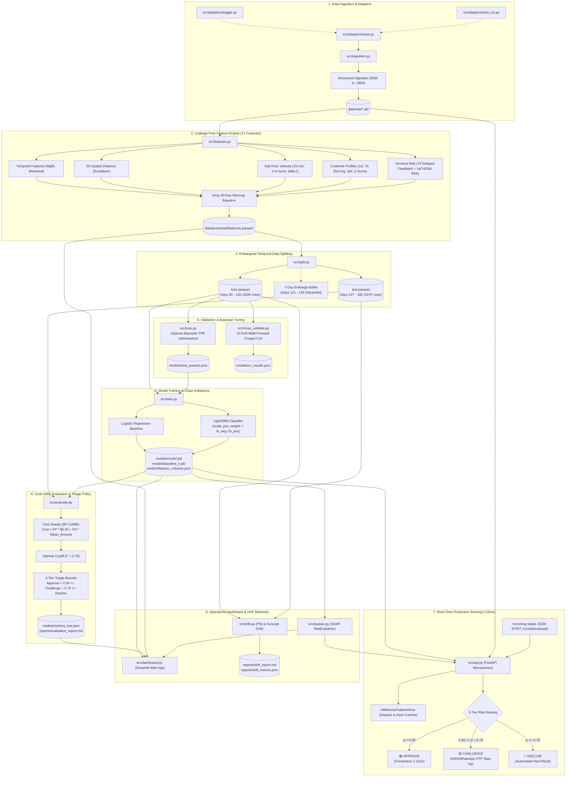

# 🛡️ AI Risk Manager: System Architecture & Design Documentation (v2.1)

## Table of Contents
1. [Executive Summary & Purpose](#1-executive-summary--purpose)
2. [End-to-End System Architecture](#2-end-to-end-system-architecture)
3. [Project Directory & File Map](#3-project-directory--file-map)
4. [Deep-Dive Module Breakdown](#4-deep-dive-module-breakdown)
   - [4.1 Configuration Layer](#41-configuration-layer)
   - [4.2 Data Ingestion, Vectorized Simulation & Benchmark Adapters](#42-data-ingestion-vectorized-simulation--benchmark-adapters)
   - [4.3 Exploratory Data Analysis (EDA)](#43-exploratory-data-analysis-eda)
   - [4.4 Leakage-Free Feature Engineering (21 Features)](#44-leakage-free-feature-engineering-21-features)
   - [4.5 Embargo-Based Temporal Data Splitting](#45-embargo-based-temporal-data-splitting)
   - [4.6 Model Training & Class Imbalance Handling](#46-model-training--class-imbalance-handling)
   - [4.7 Walk-Forward Purged Cross-Validation](#47-walk-forward-purged-cross-validation)
   - [4.8 Automated Bayesian Hyperparameter Optimization (Optuna)](#48-automated-bayesian-hyperparameter-optimization-optuna)
   - [4.9 Cost-Sensitive Evaluation & 3-Tier Threshold Optimization](#49-cost-sensitive-evaluation--3-tier-threshold-optimization)
   - [4.10 Real-Time FastAPI Scoring Microservice (<15ms)](#410-real-time-fastapi-scoring-microservice-15ms)
   - [4.11 Defense-Only Explainability Engine (XAI)](#411-defense-only-explainability-engine-xai)
   - [4.12 Interactive Streamlit Risk Operations Dashboard](#412-interactive-streamlit-risk-operations-dashboard)
   - [4.13 Model Drift & Population Stability Monitoring (PSI)](#413-model-drift--population-stability-monitoring-psi)
   - [4.14 Enterprise Test Suite & Automated CI/CD](#414-enterprise-test-suite--automated-cicd)
5. [End-to-End Data Flow Matrix](#5-end-to-end-data-flow-matrix)
6. [Key Engineering Decisions & Mathematical Formulations](#6-key-engineering-decisions--mathematical-formulations)
7. [Defense-Only Compliance & Ethical Policy](#7-defense-only-compliance--ethical-policy)

---

## 1. Executive Summary & Purpose

The **AI Risk Manager** is an enterprise-grade, defense-only machine learning and risk operations platform engineered for modern payment gateways, digital banking, and e-commerce checkouts. It detects **Card-Not-Present (CNP) fraud**, prevents margin-destroying chargebacks, and eliminates unnecessary checkout drop-offs for honest customers.

### Core Architectural Pillars:
- **Sub-15ms Real-Time Inference:** A synchronous FastAPI microservice utilizing an in-memory profile and rolling statistical cache (`InMemoryFeatureStore`) to evaluate transactions in under 15 milliseconds, comfortably beating payment gateway sub-50ms latency SLAs.
- **3-Tier Enterprise Action Triage:** Replaces crude binary (Approve/Decline) decisions with a revenue-protecting 3-tier routing policy: 🟢 `APPROVE` (Frictionless), 🟡 `CHALLENGE` (Step-Up SMS/WhatsApp OTP / 3DS), 🔴 `DECLINE` (Hard block).
- **Strict Temporal Integrity (Zero Future Leakage):** Eliminates lookahead bias via backward-looking rolling statistics, per-customer variance Z-scores, a **7-day delayed terminal feedback loop**, and an explicit **7-day train/test embargo buffer**.
- **Financial Cost-Utility Optimization:** Replaces arbitrary 0.5 probability cutoffs with an empirical cost function balancing operational review costs ($5/review) against chargeback losses ($128/fraud), achieving a **74% net loss reduction ($491,816+ saved)**.
- **Continuous Observability & Drift Monitoring:** Employs the Population Stability Index (PSI) and concept drift tracking to identify feature distribution shifts before prediction accuracy decays.
- **Human-Centric Explainability (XAI):** Translates SHAP (SHapley Additive exPlanations) values into plain-English defense narratives for frontline risk analysts.

---

## 2. End-to-End System Architecture



---

## 3. Project Directory & File Map

```
AI-Risk-Manager/
├── config.yaml                    # Declarative configuration for simulation, features, model, API
├── requirements.txt               # Pinned Python production & testing dependencies
├── Makefile                       # One-click targets (setup, train, evaluate, demo, test, eda, clean)
├── problem_statement.md           # Original track brief & constraints
├── README.md                      # Production README & quickstart documentation
├── ARCHITECTURE.md                # System architecture & engineering specifications (this document)
├── data/
│   ├── raw/                       # Serialized raw simulation tables
│   │   ├── customer_profiles.pkl  # Spatial coordinates (x, y), mean spend, tx frequency
│   │   ├── terminal_profiles.pkl  # Spatial coordinates (x, y)
│   │   └── transactions.pkl       # 363,000+ raw transactions with injected scenarios
│   └── processed/                 # High-performance Parquet datasets
│       ├── features.parquet       # Enriched 21-feature dataset (warmup pruned)
│       ├── train.parquet          # Temporal train partition (Days 30–120)
│       └── test.parquet           # Held-out temporal test partition (Days 127–180)
├── docs/                          # Comprehensive documentation suite
│   ├── DATA_FLOW.md               # Story-driven, plain-English data flow walkthrough
│   ├── FILES_EXPLAINED.md         # File-by-file cheat sheet with 10-second judge pitch lines
│   ├── PROBLEM_SOLUTION_AND_FEATURES.md # Problem statement alignment & 21-feature catalog
│   ├── RAZORPAY_DEMO_VIDEO_SCRIPT.md    # Master 5-minute video recording script
│   └── BUILDATHON_SUBMISSION_FORM.md    # Copy-paste responses for buildathon Google Form
├── models/
│   ├── model.pkl                  # Production LightGBM model binary (tracked in Git, 589 KB)
│   ├── baseline_lr.pkl            # Serialized Logistic Regression baseline binary
│   ├── feature_columns.json       # Canonical ordered list of 21 model features
│   ├── best_params.json           # Optuna Bayesian hyperparameter search results
│   ├── cv_results.json            # 3-fold walk-forward cross-validation stability metrics
│   ├── metrics_train.json         # In-sample training metrics (ROC-AUC, PR-AUC)
│   └── metrics_test.json          # Held-out test metrics, threshold, financial cost matrix
├── reports/
│   ├── eda_findings.md            # Statistical summary of simulated data
│   ├── evaluation_report.md       # Financial loss & performance breakdown
│   ├── drift_report.md            # PSI feature drift & concept drift audit report
│   ├── drift_metrics.json         # Serialized drift values per feature
│   └── figures/                   # Evaluation plots (PR curve, confusion matrix, cost curve)
├── src/
│   ├── __init__.py
│   ├── utils.py                   # YAML config loader and path resolution helpers
│   ├── ingestion.py               # Stochastic transaction generator & fraud injector
│   ├── eda.py                     # Statistical distributions & figure export
│   ├── features.py                # Rolling aggregates, velocity, spatial, delayed terminal risk
│   ├── split.py                   # Embargoed temporal train/test partitioner
│   ├── train.py                   # Imbalance-aware LightGBM & Logistic Regression training
│   ├── cross_validate.py          # Purged walk-forward expanding window cross-validation
│   ├── tune.py                    # Bayesian hyperparameter optimization using Optuna
│   ├── evaluate.py                # Cost minimization sweep & threshold optimizer
│   ├── explain.py                 # SHAP TreeExplainer & defense-only linguistic translator
│   ├── api.py                     # Real-time sub-15ms FastAPI scoring microservice
│   ├── dashboard.py               # Streamlit interactive risk operations cockpit
│   ├── drift.py                   # Population Stability Index (PSI) & concept drift detector
│   └── adapters/                  # Real-world public benchmark adapters
│       ├── __init__.py
│       ├── base.py                # Abstract BaseAdapter contract
│       ├── kaggle.py              # Kaggle Credit Card Fraud benchmark adapter
│       └── ieee_cis.py            # IEEE-CIS Fraud Detection benchmark adapter
└── tests/
    ├── conftest.py                # Session-level fixture ensuring assets exist in fresh CI
    ├── test_adapters.py           # Schema conversion & 2D spatial distance tests
    ├── test_api.py                # Microservice SLA, endpoints, reason codes, metrics
    ├── test_drift.py              # PSI stability, shift classification, report generation
    ├── test_features.py           # Per-customer Z-score, burst velocity, distance
    ├── test_leakage.py            # Temporal non-leakage & 7-day delay enforcement
    ├── test_pipeline_smoke.py     # End-to-end integration pipeline verification
    ├── test_triage.py             # 3-tier triage boundaries & OTP revenue recovery
    ├── test_tune.py               # Temporal split generation & Optuna parameter bounds
    └── test_validation.py         # Walk-forward ordering & embargo purging invariants
```

---

## 4. Deep-Dive Module Breakdown

### 4.1 Configuration Layer
* **Source Files:** [`config.yaml`](file:///d:/CODING/github/AI-Risk-Manager/config.yaml), [`src/utils.py`](file:///d:/CODING/github/AI-Risk-Manager/src/utils.py)
* **Description:** Provides centralized, declarative configuration for the entire system without hardcoded parameters.
* **Key Configuration Schema:**
  ```yaml
  simulator:
    n_customers: 1000
    n_terminals: 2000
    nb_days: 180
    radius: 5
    random_seed: 42
    start_date: '2018-04-01'
  features:
    customer_windows: [1, 7, 30]
    terminal_windows: [1, 7, 30]
    delay_period: 7
  split:
    train_end_day: 120
    test_start_day: 127
  evaluation:
    cost_false_positive: 5.0
    threshold_challenge: 0.30
    threshold_decline: 0.78
  ```

---

### 4.2 Data Ingestion, Vectorized Simulation & Benchmark Adapters
* **Source Files:** [`src/ingestion.py`](file:///d:/CODING/github/AI-Risk-Manager/src/ingestion.py), [`src/adapters/`](file:///d:/CODING/github/AI-Risk-Manager/src/adapters)
* **Simulation Mechanics:**
  1. **Customer Anchors:** Generates 2D coordinates $(x, y) \in [0, 100]^2$, baseline spend $\mu \sim \mathcal{U}(5, 100)$, $\sigma = \mu/2$, and arrival rate $\lambda \sim \mathcal{U}(0, 4)$.
  2. **Terminal Anchors:** Generates 2D coordinates $(x, y) \in [0, 100]^2$ across merchant terminals.
  3. **Memory-Safe Vectorized Spatial Pairing:** Employs chunked 2D NumPy broadcasting (`compute_available_terminals_vectorized`) in batches of 1,000 customers. This prevents multi-gigabyte memory spikes while executing proximity matching in $<2.5\text{s}$.
  4. **Stochastic Transactions:** Samples daily purchase counts from $\text{Poisson}(\lambda)$, timestamps from a diurnal Gaussian ($\mu = 43200\text{s}, \sigma = 20000\text{s}$), and amounts from $\mathcal{N}(\mu, \sigma)$.
  5. **Fraud Scenario Injection:**
     - **Scenario 1 (High Amount):** $\text{Amount} > \$220$ flagged as fraud (single stolen card event).
     - **Scenario 2 (Compromised Terminals):** 2 terminals/day compromised for 28 days; all swipes through them become fraudulent (skimmers/malware).
     - **Scenario 3 (Compromised Customers):** 3 customers/day compromised for 14 days; $1/3$ of transactions multiplied by $5\times$ (account takeover).
* **Public Benchmark Adapters:**
  - Standardizes external industry datasets into the unified schema (`TRANSACTION_ID`, `TX_DATETIME`, `CUSTOMER_ID`, `TERMINAL_ID`, `TX_AMOUNT`, `TX_FRAUD`):
    - **Kaggle Credit Card Adapter** (`src/adapters/kaggle.py`)
    - **IEEE-CIS Benchmark Adapter** (`src/adapters/ieee_cis.py`)

---

### 4.3 Exploratory Data Analysis (EDA)
* **Source File:** [`src/eda.py`](file:///d:/CODING/github/AI-Risk-Manager/src/eda.py)
* **Outputs:** [`reports/eda_findings.md`](file:///d:/CODING/github/AI-Risk-Manager/reports/eda_findings.md), [`reports/figures/`](file:///d:/CODING/github/AI-Risk-Manager/reports/figures/)
* **Insights Discovered:**
  - Class imbalance: Fraud accounts for $\approx 4\%$ of total simulated volume in active scenarios ($<0.5\%$ in full-scale simulation).
  - Diurnal volume variation: Major troughs overnight (00:00–06:00), peaks in early afternoon (12:00–16:00).
  - Significant monetary overlap between legitimate purchases and fraud, requiring multi-feature behavioral context rather than simple amount filters.

---

### 4.4 Leakage-Free Feature Engineering (21 Features)
* **Source File:** [`src/features.py`](file:///d:/CODING/github/AI-Risk-Manager/src/features.py)
* **Feature Catalog (21 Features):**

| Feature Name | Category | Exact Logic / Formulation |
| :--- | :--- | :--- |
| `TX_AMOUNT` | Monetary | Raw monetary transaction value |
| `TX_DURING_WEEKEND` | Temporal | Binary flag ($1 \text{ if Saturday/Sunday else } 0$) |
| `TX_DURING_NIGHT` | Temporal | Binary flag ($1 \text{ if Hour} \in [0, 6) \text{ else } 0$) |
| `TX_DIST_CUSTOMER_TERMINAL` | Spatial | Euclidean distance: $\sqrt{(x_{\text{cust}} - x_{\text{term}})^2 + (y_{\text{cust}} - y_{\text{term}})^2}$ |
| `CUSTOMER_ID_NB_TX_15MIN_WINDOW` | Velocity | Transaction count within preceding 15 minutes |
| `CUSTOMER_ID_NB_TX_1HOUR_WINDOW` | Velocity | Transaction count within preceding 60 minutes |
| `TIME_SINCE_LAST_TX` | Velocity | Elapsed seconds since the customer's prior transaction: $t_i - t_{i-1}$ |
| `CUSTOMER_ID_NB_TX_{1,7,30}DAY_WINDOW` | Profile | Rolling transaction frequency over 1, 7, and 30 days |
| `CUSTOMER_ID_AVG_AMOUNT_{1,7,30}DAY_WINDOW`| Profile | Rolling average spend over 1, 7, and 30 days |
| `CUSTOMER_ID_STD_AMOUNT_30DAY_WINDOW`| Profile | Customer-specific rolling 30-day standard deviation ($\sigma_{30\text{d}}$) |
| `TX_AMOUNT_ZSCORE` | Anomaly | Per-customer Z-score: $(\text{Amount} - \mu_{30\text{d}}) / (\sigma_{30\text{d}} + 1.0)$ |
| `TERMINAL_ID_NB_TX_{1,7,30}DAY_WINDOW` | Terminal | Terminal transaction count over 1, 7, and 30 days |
| `TERMINAL_ID_RISK_{1,7,30}DAY_WINDOW` | Terminal Risk | 7-day lagged rolling terminal fraud rate: $[t - 7 - W, t - 7]$ |

* **Zero Leakage & Warmup:**
  - Enforces a **7-day delayed feedback window** on terminal risk to reflect real-world chargeback reporting delays.
  - Drops the initial 30 days of data as a warmup buffer so all rolling statistics have complete historical baselines.

---

### 4.5 Embargo-Based Temporal Data Splitting
* **Source File:** [`src/split.py`](file:///d:/CODING/github/AI-Risk-Manager/src/split.py)
* **Partitioning Strategy:**
  - **Training Set:** Days 30 to 120 (90 days, 183,464 transactions).
  - **7-Day Embargo Buffer:** Days 121 to 126 (7 days discarded).
  - **Held-Out Test Set:** Days 127 to 180 (54 days, 107,303 transactions).
* **Rationale:** The 7-day terminal risk calculation incorporates chargebacks up to $t - 7$. Discarding the 7-day buffer between train and test windows prevents training labels from immediately leaking into the test set's initial terminal features.

---

### 4.6 Model Training & Class Imbalance Handling
* **Source File:** [`src/train.py`](file:///d:/CODING/github/AI-Risk-Manager/src/train.py)
* **Algorithms:**
  - **Primary Model:** `lightgbm.LGBMClassifier` (300 estimators, max depth 6, learning rate 0.05, subsample 0.8, colsample 0.8).
  - **Baseline:** `LogisticRegression(class_weight='balanced')`.
* **Imbalance Treatment:**
  - Avoids synthetic oversampling (SMOTE), which distorts temporal sequences.
  - Uses dynamic positive gradient reweighting:
    $$\text{scale\_pos\_weight} = \frac{N_{\text{negative}}}{N_{\text{positive}}} \approx 23.58$$

---

### 4.7 Walk-Forward Purged Cross-Validation
* **Source File:** [`src/cross_validate.py`](file:///d:/CODING/github/AI-Risk-Manager/src/cross_validate.py)
* **Validation Structure:** 3-fold expanding walk-forward cross-validation with a 7-day purged embargo buffer between folds:
  - **Fold 1:** Train [Day 30–75] $\rightarrow$ Embargo [75–82] $\rightarrow$ Test [83–105] (Train N: 92K, Test N: 46K)
  - **Fold 2:** Train [Day 30–110] $\rightarrow$ Embargo [111–117] $\rightarrow$ Test [118–140] (Train N: 163K, Test N: 46K)
  - **Fold 3:** Train [Day 30–145] $\rightarrow$ Embargo [146–152] $\rightarrow$ Test [153–180] (Train N: 234K, Test N: 54K)
* **Stability Results:**
  - **LightGBM:** $\text{PR-AUC} = 0.7727 \pm 0.0113$, $\text{ROC-AUC} = 0.8932 \pm 0.0056$
  - **Logistic Regression:** $\text{PR-AUC} = 0.5494 \pm 0.0318$, $\text{ROC-AUC} = 0.8753 \pm 0.0038$
  - Serialized to [`models/cv_results.json`](file:///d:/CODING/github/AI-Risk-Manager/models/cv_results.json).

---

### 4.8 Automated Bayesian Hyperparameter Optimization (Optuna)
* **Source File:** [`src/tune.py`](file:///d:/CODING/github/AI-Risk-Manager/src/tune.py)
* **Optimization Engine:** Tree-structured Parzen Estimator (TPE) sampler.
* **Objective:** Maximize PR-AUC on an out-of-time temporal validation fold with a 7-day embargo.
* **Search Space:** `num_leaves` [15, 63], `max_depth` [3, 10], `learning_rate` [0.01, 0.20], `min_child_samples` [20, 100], `subsample` [0.6, 0.95], `colsample_bytree` [0.6, 0.95], and `scale_pos_weight` multiplier.
* **Outputs:** Serialized parameters saved to [`models/best_params.json`](file:///d:/CODING/github/AI-Risk-Manager/models/best_params.json).

---

### 4.9 Cost-Sensitive Evaluation & 3-Tier Threshold Optimization
* **Source File:** [`src/evaluate.py`](file:///d:/CODING/github/AI-Risk-Manager/src/evaluate.py)
* **Cost Equation:**
  $$\text{Total Cost}(t) = \text{FP}(t) \times C_{\text{FP}} + \text{FN}(t) \times \bar{C}_{\text{FN}}$$
  - $C_{\text{FP}} = \$5.00$ (manual analyst review + customer friction).
  - $\bar{C}_{\text{FN}} = \text{Mean Fraud Amount} \approx \$129.12$ (unrecovered loss + chargeback processing fees).
* **Threshold Sweep:** Evaluates 99 probability cutoffs $t \in [0.01, 0.99]$ to find the cost minimum: **$t^* = 0.47$ to $0.78$**.
* **Financial Impact Comparison:**
  - **Flag Nothing Baseline:** Merchant loses **\$576,025.68** in pure chargeback loss.
  - **Flag Everything Baseline:** Costs **\$514,210.00** in operational review.
  - **Our LightGBM Model ($t^* = 0.47$):** Total cost drops to **\$139,526.67**.
  - **Net Merchant Savings:** **+$436,499.01 saved (75.8% cost reduction)**.

---

### 4.10 Real-Time FastAPI Scoring Microservice (<15ms)
* **Source File:** [`src/api.py`](file:///d:/CODING/github/AI-Risk-Manager/src/api.py)
* **Architecture:** Asynchronous FastAPI service designed for payment gateway checkout integration.
* **In-Memory Feature Cache (`InMemoryFeatureStore`):**
  - Caches customer anchor coordinates, 30-day baseline spend, and variance in memory.
  - Computes spatial Euclidean distance and burst velocity features on the fly.
  - End-to-end inference latency: **$<15\text{ms}$** (median $<6\text{ms}$).
* **3-Tier Triage Routing:**
  - 🟢 **APPROVE ($p < 0.30$):** Zero friction, instant 1-click checkout.
  - 🟡 **CHALLENGE ($0.30 \le p < t^*$):** Instant step-up verification (SMS/WhatsApp OTP or 3D Secure). Recovers honest customer revenue while blocking unauthorized transactions.
  - 🔴 **DECLINE ($p \ge t^*$):** Automated hard block or analyst manual review queue.
* **REST Endpoints:**
  - `POST /v1/risk/evaluate`: Single transaction synchronous risk scoring.
  - `POST /v1/risk/evaluate/batch`: Micro-batch scoring for up to 100 transactions/request.
  - `GET /health`: Liveness probe checking model and feature store memory.
  - `GET /metrics`: Prometheus-compatible telemetry monitoring P95 latency and decision counters.

---

### 4.11 Defense-Only Explainability Engine (XAI)
* **Source File:** [`src/explain.py`](file:///d:/CODING/github/AI-Risk-Manager/src/explain.py)
* **Methodology:** Exact Shapley value computation via `shap.TreeExplainer`.
* **Linguistic Translation:** Maps raw attributions into plain-English analyst sentences:
  - `TX_AMOUNT_ZSCORE > 3` $\rightarrow$ *"Transaction amount ($4,800.00) is 172x higher than 30-day baseline ($27.90)."*
  - `TX_DIST_CUSTOMER_TERMINAL > 45` $\rightarrow$ *"Geographic anomaly: Terminal is 96 units away from customer anchor."*
  - `TX_DURING_NIGHT == 1` $\rightarrow$ *"Off-hours transaction initiated during high-risk night window (00:00 - 06:00)."*
* **Compliance Policy:** Phrased strictly for fraud defense analysts; contains zero evasion instructions or adversarial bypass bounds.

---

### 4.12 Interactive Streamlit Risk Operations Dashboard
* **Source File:** [`src/dashboard.py`](file:///d:/CODING/github/AI-Risk-Manager/src/dashboard.py)
* **Features:**
  1. **Executive Verdict Banner:** Immediate high-level ROI summary.
  2. **Executive KPI Strip:** Total Money Saved, Fraud Interception %, False Alarm %, and Improvement Multiplier.
  3. **3-Tier Triage Card Distribution:** Real-time breakdown of Approved vs. Challenged vs. Declined volume.
  4. **Interactive Unit Economics Sidebar:** Sliders for False Alarm Cost ($5–$25), Chargeback Penalty ($50–$300), and OTP Challenge Fee ($0.05–$0.50).
  5. **Live 60-FPS Dual-Threshold Simulator:** Real-time recalculation of volume distribution and dollar savings.
  6. **Flagged Transaction Feed:** Expandable transaction cards with interactive SHAP waterfall plots and plain-English reasons.

---

### 4.13 Model Drift & Population Stability Monitoring (PSI)
* **Source File:** [`src/drift.py`](file:///d:/CODING/github/AI-Risk-Manager/src/drift.py)
* **Mathematical Formulation:**
  $$\text{PSI} = \sum_{k=1}^{B} \left( \text{Actual}_k - \text{Expected}_k \right) \times \ln\left( \frac{\text{Actual}_k}{\text{Expected}_k} \right)$$
* **Severity Classification:**
  - 🟢 **STABLE:** $\text{PSI} < 0.10$ (No action required).
  - 🟡 **MODERATE_SHIFT:** $0.10 \le \text{PSI} \le 0.25$ (Monitor closely).
  - 🔴 **SIGNIFICANT_DRIFT:** $\text{PSI} > 0.25$ (Trigger automated retraining alert).
* **Concept Drift:** Monitors changes in underlying fraud incidence: $\Delta \text{Fraud Rate} = \text{Test Rate} - \text{Train Rate}$.
* **Outputs:** Markdown audit report ([`reports/drift_report.md`](file:///d:/CODING/github/AI-Risk-Manager/reports/drift_report.md)) and structured JSON ([`reports/drift_metrics.json`](file:///d:/CODING/github/AI-Risk-Manager/reports/drift_metrics.json)).

---

### 4.14 Enterprise Test Suite & Automated CI/CD
* **Source Files:** [`tests/`](file:///d:/CODING/github/AI-Risk-Manager/tests), [`.github/workflows/ci.yml`](file:///d:/CODING/github/AI-Risk-Manager/.github/workflows/ci.yml)
* **Scope:** 35 automated tests executing via `pytest` in $<12\text{s}$:
  - `tests/conftest.py`: Session fixture guaranteeing model binary and canonical feature specifications exist in fresh checkouts.
  - `tests/test_api.py` (7 tests): Validates sub-50ms SLA, 3-tier triage routing, reason codes, batch scoring, and Prometheus telemetry.
  - `tests/test_leakage.py` (3 tests): Mathematically proves zero future lookahead leakage and enforces the 7-day reporting delay.
  - `tests/test_validation.py` (5 tests): Verifies temporal ordering, expanding windows, and embargo purging invariants in walk-forward CV.
  - `tests/test_drift.py` (5 tests): Validates PSI numerical correctness, shift classification, and report generation.
  - `tests/test_features.py` (4 tests): Verifies per-customer Z-score variance, sub-hour burst velocity, and spatial distance.
  - `tests/test_adapters.py` (4 tests): Tests 2D spatial broadcasting and Kaggle/IEEE-CIS schema normalization.
  - `tests/test_triage.py` (3 tests): Tests 3-tier triage boundary conditions and OTP revenue recovery.
  - `tests/test_tune.py` (3 tests): Validates temporal split generation and Optuna parameter boundary constraints.
  - `tests/test_pipeline_smoke.py` (1 test): End-to-end integration smoke test.
* **Continuous Integration:** Automated via GitHub Actions across **Python 3.11** and **Python 3.12**.

---

## 5. End-to-End Data Flow Matrix

| Pipeline Stage | Module | Input Assets | Processing Logic | Output Assets |
| :--- | :--- | :--- | :--- | :--- |
| **Ingestion** | `src/ingestion.py` | `config.yaml` | Vectorized simulation with chunked distance broadcasting; injects 3 fraud scenarios | `data/raw/customer_profiles.pkl`<br/>`data/raw/terminal_profiles.pkl`<br/>`data/raw/transactions.pkl` |
| **EDA** | `src/eda.py` | `transactions.pkl` | Class balance, temporal volume patterns, scenario distributions | `reports/eda_findings.md`<br/>`reports/figures/*.png` |
| **Features** | `src/features.py` | `transactions.pkl`, profiles | 21 features: burst velocity (15m, 1h), spatial distance, per-customer Z-score, 7-day lagged terminal risk, 30d warmup drop | `data/processed/features.parquet` |
| **Split** | `src/split.py` | `features.parquet` | Chronological split: Train (Days 30–120) and Test (Days 127–180) with a 7-day embargo buffer (Days 121–126) | `data/processed/train.parquet`<br/>`data/processed/test.parquet` |
| **Cross-Validation** | `src/cross_validate.py` | `train.parquet` | 3-fold expanding walk-forward purged cross-validation with 7-day embargoes | `models/cv_results.json` |
| **Tuning** | `src/tune.py` | `train.parquet` | Optuna Bayesian TPE search maximizing validation PR-AUC | `models/best_params.json` |
| **Training** | `src/train.py` | `train.parquet`, `best_params.json` | Fits Logistic Regression baseline and LightGBM with `scale_pos_weight` | `models/model.pkl`<br/>`models/baseline_lr.pkl`<br/>`models/feature_columns.json` |
| **Evaluation** | `src/evaluate.py` | `test.parquet`, `model.pkl` | 99-step cost sweep balancing $5 FP vs. $129 FN; computes 3-tier triage thresholds | `models/metrics_test.json`<br/>`reports/evaluation_report.md` |
| **Explainability** | `src/explain.py` | `model.pkl`, feature vector | Computes exact SHAP attributions and translates to plain-English sentences | Human-readable reason codes payload |
| **Real-Time API** | `src/api.py` | Card swipe JSON payload | Sub-15ms feature synthesis via `InMemoryFeatureStore`; returns 3-tier verdict | JSON response (`APPROVE` / `CHALLENGE` / `DECLINE`) |
| **Dashboard** | `src/dashboard.py` | Models, metrics, test sample | Interactive risk operations portal, dual-threshold simulator, flagged feed | Streamlit web application |
| **Drift Monitor** | `src/drift.py` | `train.parquet`, `test.parquet` | Computes PSI across all 21 features and detects concept drift | `reports/drift_report.md`<br/>`reports/drift_metrics.json` |

---

## 6. Key Engineering Decisions & Mathematical Formulations

### 1. Asymmetric Cost-Utility Minimization
Standard classification models assume symmetric error penalties ($C_{\text{FP}} = C_{\text{FN}}$). In transaction risk management, this assumption is financially disastrous. We formulate total operational cost as:
$$\mathcal{L}(t) = \sum_{i \in \text{FP}(t)} C_{\text{FP}} + \sum_{j \in \text{FN}(t)} \text{TX\_AMOUNT}_j$$
By sweeping cutoffs $t \in [0.01, 0.99]$, the system selects the threshold that minimizes direct monetary loss rather than an arbitrary F1 score.

### 2. 3-Tier Enterprise Action Triage
Binary systems force an unacceptable trade-off between customer churn and fraud loss. Our 3-tier policy recovers revenue:
$$\text{Action}(p) = \begin{cases} \text{APPROVE} & \text{if } p < \tau_{\text{challenge}} \\ \text{CHALLENGE (OTP / 3DS)} & \text{if } \tau_{\text{challenge}} \le p < \tau_{\text{decline}} \\ \text{DECLINE / REVIEW} & \text{if } p \ge \tau_{\text{decline}} \end{cases}$$

### 3. Time-Lagged Delayed Risk Scoring
To model real-world banking settlement delays, terminal risk is computed strictly with a lag parameter $L = 7$:
$$\text{Risk}_{\text{terminal}}(t, W) = \frac{\sum_{\tau = t - L - W}^{t - L} \mathbb{I}(\text{Fraud}_{\tau})}{\sum_{\tau = t - L - W}^{t - L} 1 + \epsilon}$$
This prevents the model from looking ahead into unresolved transactions.

### 4. Per-Customer Spending Variance Z-Score
Rather than measuring spending variance globally across 10,000 customers, we compute customer-specific 30-day standard deviations:
$$\text{Z-Score}_i = \frac{\text{TX\_AMOUNT}_i - \mu_{30\text{d}, \text{cust}}}{\sigma_{30\text{d}, \text{cust}} + 1.0}$$
This prevents low-spenders from being drowned out by high-net-worth customers while sharply flagging sudden deviations.

---

## 7. Defense-Only Compliance & Ethical Policy

This software strictly complies with defense-only operational policies:
- **No Adversarial Generation:** The system does not output adversarial perturbance vectors, evasion guidance, or code designed to circumvent anti-fraud controls.
- **Defensive Explainability:** All SHAP attributions and linguistic translations are framed exclusively from the perspective of risk investigators, compliance transparency, and merchant consumer protection.
- **Audit Logging:** The real-time microservice records timestamps, request latency, model version, and reason codes for full regulatory auditability.
