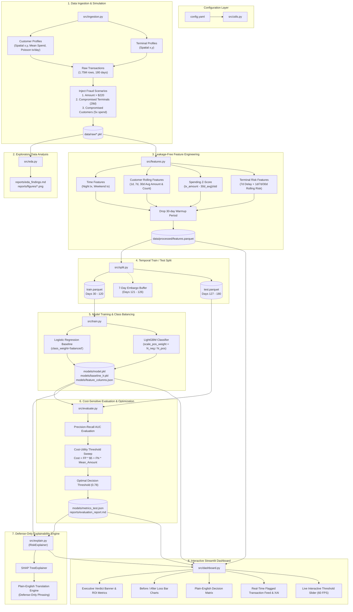

# AI Risk Manager: System Architecture & Design Documentation

## Table of Contents
1. [Executive Summary & Purpose](#1-executive-summary--purpose)
2. [End-to-End System Architecture](#2-end-to-end-system-architecture)
3. [Project Directory & File Map](#3-project-directory--file-map)
4. [Deep-Dive Module Breakdown](#4-deep-dive-module-breakdown)
   - [4.1 Configuration Layer](#41-configuration-layer)
   - [4.2 Data Ingestion & Multi-Scenario Simulation](#42-data-ingestion--multi-scenario-simulation)
   - [4.3 Exploratory Data Analysis (EDA)](#43-exploratory-data-analysis-eda)
   - [4.4 Leakage-Free Feature Engineering](#44-leakage-free-feature-engineering)
   - [4.5 Embargo-Based Temporal Data Splitting](#45-embargo-based-temporal-data-splitting)
   - [4.6 Model Training & Class Imbalance Handling](#46-model-training--class-imbalance-handling)
   - [4.7 Cost-Sensitive Evaluation & Threshold Optimization](#47-cost-sensitive-evaluation--threshold-optimization)
   - [4.8 Defense-Only Explainability Engine (XAI)](#48-defense-only-explainability-engine-xai)
   - [4.9 Interactive Streamlit Risk Dashboard](#49-interactive-streamlit-risk-dashboard)
   - [4.10 Automated Testing & Smoke Verification](#410-automated-testing--smoke-verification)
5. [End-to-End Data Flow Matrix](#5-end-to-end-data-flow-matrix)
6. [Key Engineering Decisions & Mathematical Formulations](#6-key-engineering-decisions--mathematical-formulations)
7. [Defense-Only Compliance & Policy](#7-defense-only-compliance--policy)

---

## 1. Executive Summary & Purpose

The **AI Risk Manager** is a production-grade, defense-only machine learning system designed to detect **Card-Not-Present (CNP) fraud**, mitigate chargeback losses, and minimize operational review friction for merchants and financial institutions.

### Core Objectives:
- **Financial Cost Minimization:** Replaces arbitrary classification thresholds (like 0.5) with a rigorous cost-utility objective function balancing false positive review friction ($5/review) against chargeback losses (average fraud transaction value).
- **Strict Temporal Integrity:** Eliminates lookahead bias and temporal data leakage via backward-looking rolling statistics, a 7-day delayed terminal feedback loop, and a 7-day train/test embargo buffer.
- **Human-Centric Interpretability:** Integrates SHAP (SHapley Additive exPlanations) mapped to plain-English, defender-focused sentences for non-technical risk investigators.

---

## 2. End-to-End System Architecture



---

## 3. Project Directory & File Map

```
AI-Risk-Manager/
├── config.yaml                    # Centralized hyperparameter & pipeline configuration
├── requirements.txt               # Pinned Python dependencies
├── Makefile                       # Automation targets for pipeline steps
├── problem_statement.md           # Business requirements & track objectives
├── README.md                      # Quickstart guide & high-level overview
├── ARCHITECTURE.md                # Full technical architecture documentation (this file)
├── data/
│   ├── raw/                       # Pickled raw simulation tables
│   │   ├── customer_profiles.pkl
│   │   ├── terminal_profiles.pkl
│   │   └── transactions.pkl
│   └── processed/                 # High-performance Parquet datasets
│       ├── features.parquet
│       ├── train.parquet
│       └── test.parquet
├── models/
│   ├── model.pkl                  # Serialized LightGBM model binary
│   ├── baseline_lr.pkl            # Serialized Logistic Regression baseline
│   ├── feature_columns.json       # Canonical ordered list of model features
│   ├── metrics_train.json         # In-sample training metrics (ROC-AUC, PR-AUC)
│   └── metrics_test.json          # Held-out test metrics, threshold, confusion matrix
├── reports/
│   ├── eda_findings.md            # Statistical summary of simulated data
│   ├── evaluation_report.md       # Financial loss & performance breakdown
│   └── figures/                   # Visualizations (PR curve, confusion matrix, cost curve)
├── src/
│   ├── __init__.py
│   ├── utils.py                   # YAML loader and path resolution helpers
│   ├── ingestion.py               # Stochastic transaction generator & fraud injector
│   ├── eda.py                     # EDA charts and distribution reporting
│   ├── features.py                # Rolling window aggregates & delayed terminal risk
│   ├── split.py                   # Embargoed temporal train/test partitioner
│   ├── train.py                   # Imbalance-aware LightGBM & LR training
│   ├── evaluate.py                # Cost minimization sweep & threshold optimizer
│   ├── explain.py                 # SHAP TreeExplainer & linguistic translator
│   └── dashboard.py               # Streamlit interactive UI application
└── tests/
    └── test_pipeline_smoke.py     # End-to-end integration smoke test with miniature config
```

---

## 4. Deep-Dive Module Breakdown

### 4.1 Configuration Layer
* **Source Files:** [config.yaml](file:///d:/CODING/github/AI-Risk-Manager/config.yaml), [src/utils.py](file:///d:/CODING/github/AI-Risk-Manager/src/utils.py)
* **Description:** Manages all simulation, feature engineering, modeling, and evaluation parameters in a single declarative YAML file.
* **Key Parameters:**
  ```yaml
  simulator:
    n_customers: 10000
    n_terminals: 20000
    nb_days: 180
    radius: 5
    random_seed: 42
    start_date: '2018-04-01'
  features:
    customer_windows: [1, 7, 30]
    terminal_windows: [1, 7, 30]
    delay_period: 7
  split:
    train_end_day: 120
    test_start_day: 127
  evaluation:
    cost_false_positive: 5.0
  ```

---

### 4.2 Data Ingestion & Multi-Scenario Simulation
* **Source File:** [src/ingestion.py](file:///d:/CODING/github/AI-Risk-Manager/src/ingestion.py)
* **Underlying Logic:** Implements the stochastic modeling framework from the *Fraud Detection Handbook*:
  1. **Customer Generation:** Assigns 2D grid coordinates $(x, y) \in [0, 100]^2$, mean spend $\mu_{\text{cust}} \sim \mathcal{U}(5, 100)$, $\sigma_{\text{cust}} = \mu_{\text{cust}}/2$, and transaction rate $\lambda_{\text{cust}} \sim \mathcal{U}(0, 4)$.
  2. **Terminal Generation:** Assigns 2D grid coordinates $(x, y) \in [0, 100]^2$ across 20,000 terminals.
  3. **Spatial Filtering:** Customers only make transactions at terminals within Euclidean distance $r = 5$.
  4. **Transaction Generation:** Samples daily transaction counts from $\text{Poisson}(\lambda_{\text{cust}})$, transaction times from a Gaussian centered at midday ($\mu = 43200\text{s}, \sigma = 20000\text{s}$), and amounts from $\mathcal{N}(\mu_{\text{cust}}, \sigma_{\text{cust}})$.
  5. **Fraud Scenario Injection:**
     - **Scenario 1 (High Amount):** Any transaction with $\text{Amount} > \$220$ is marked as fraud (simulates single large-ticket card theft).
     - **Scenario 2 (Compromised Terminals):** 2 terminals per day are compromised for 28 days; all transactions through them become fraudulent (simulates terminal malware/skimmers).
     - **Scenario 3 (Compromised Customers):** 3 customers per day have their identities compromised for 14 days; $1/3$ of their transactions are multiplied by $5\times$ (simulates account takeover).

---

### 4.3 Exploratory Data Analysis (EDA)
* **Source File:** [src/eda.py](file:///d:/CODING/github/AI-Risk-Manager/src/eda.py)
* **Outputs:** [reports/eda_findings.md](file:///d:/CODING/github/AI-Risk-Manager/reports/eda_findings.md), [reports/figures/](file:///d:/CODING/github/AI-Risk-Manager/reports/figures/)
* **Insights Discovered:**
  - Extreme class imbalance: Fraud represents $< 0.5\%$ of all transactions.
  - Strong diurnal volume variation (troughs between 00:00–06:00, peaks at 12:00–16:00).
  - Fraud amounts have significant overlap with legitimate transactions, proving that simple heuristic thresholding is insufficient.

---

### 4.4 Leakage-Free Feature Engineering
* **Source File:** [src/features.py](file:///d:/CODING/github/AI-Risk-Manager/src/features.py)
* **Feature Set (16 Features):**
  1. **Time Context:**
     - `TX_DURING_WEEKEND`: Binary indicator for Saturday/Sunday.
     - `TX_DURING_NIGHT`: Binary indicator for transactions before 06:00 AM.
  2. **Customer Spending Behavior:**
     - `CUSTOMER_ID_NB_TX_{1,7,30}DAY_WINDOW`: Rolling counts of customer transactions over 1, 7, and 30 days.
     - `CUSTOMER_ID_AVG_AMOUNT_{1,7,30}DAY_WINDOW`: Rolling mean spend of the customer over 1, 7, and 30 days.
     - `TX_AMOUNT_ZSCORE`: Spend deviation relative to the customer's 30-day history:
       $$\text{Z-Score} = \frac{\text{TX\_AMOUNT} - \mu_{30\text{d}}}{\sigma_{30\text{d}} + \epsilon}$$
  3. **Delayed Terminal Risk (No Label Leakage):**
     - Real-world fraud labels arrive with a delay ($\approx 7$ days) due to cardholder verification and bank chargeback processing.
     - To prevent future data leakage, terminal fraud risk is computed on the time slice $[t - \text{delay} - W, t - \text{delay}]$ using backward `pandas.merge_asof`:
       $$\text{Risk}(t) = \frac{\text{Fraud Count}_{[t-7-W, t-7]}}{\text{Transaction Count}_{[t-7-W, t-7]} + \epsilon}$$
     - Produces `TERMINAL_ID_NB_TX_{1,7,30}DAY_WINDOW` and `TERMINAL_ID_RISK_{1,7,30}DAY_WINDOW`.
  4. **Warmup Window Pruning:** The initial 30 days of data are dropped to ensure all rolling features have complete historical baselines.

---

### 4.5 Embargo-Based Temporal Data Splitting
* **Source File:** [src/split.py](file:///d:/CODING/github/AI-Risk-Manager/src/split.py)
* **Design Strategy:**
  - **Train Set:** Days 30 to 120 ($\approx 90\text{ days}$).
  - **Embargo Buffer:** Days 121 to 126 ($7\text{ days}$ discarded).
  - **Test Set:** Days 127 to 180 ($\approx 54\text{ days}$, $\approx 550,000\text{ transactions}$).
* **Why the Embargo Buffer Matters:** The 7-day terminal delay feature relies on past labels. Without a 7-day gap between training and testing, labels from the end of the training set would instantaneously propagate into the test set's terminal risk features, artificially inflating test metrics.

---

### 4.6 Model Training & Class Imbalance Handling
* **Source File:** [src/train.py](file:///d:/CODING/github/AI-Risk-Manager/src/train.py)
* **Models Trained:**
  - **Baseline:** `LogisticRegression(class_weight='balanced')`.
  - **Primary Model:** `lightgbm.LGBMClassifier` (300 estimators, max depth 6, learning rate 0.05).
* **Imbalance Treatment:**
  - Avoids synthetic oversampling (e.g., SMOTE), which distorts temporal sequences and real-world feature correlations.
  - Utilizes dynamic sample weighting:
    $$\text{scale\_pos\_weight} = \frac{N_{\text{neg}}}{N_{\text{pos}}}$$
* **Outputs:** Serialized model binaries, feature names, and train PR-AUC / ROC-AUC metrics.

---

### 4.7 Cost-Sensitive Evaluation & Threshold Optimization
* **Source File:** [src/evaluate.py](file:///d:/CODING/github/AI-Risk-Manager/src/evaluate.py)
* **Cost Function Formulation:**
  $$\text{Total Cost}(t) = \text{FP}(t) \times C_{\text{FP}} + \text{FN}(t) \times \bar{C}_{\text{FN}}$$
  - $C_{\text{FP}} = \$5.00$ (cost of manual analyst review + customer friction).
  - $\bar{C}_{\text{FN}} = \text{Mean Fraud Amount} \approx \$128.44$ (loss of goods + chargeback processing penalties).
* **Threshold Optimization Sweep:**
  - Evaluates 99 probability cutoffs $t \in [0.01, 0.99]$.
  - Finds the minimum cost threshold: **$t^* = 0.78$**.
* **Test Performance Summary:**
  - **No-Model Baseline (Flag Nothing):** Merchant loses **\$664,972.49**.
  - **Naive Baseline (Flag Everything):** Costs **\$5,253,320.00** in operational review.
  - **Our LightGBM Model ($t=0.78$):** Total cost reduced to **\$173,156.38**.
  - **Net Financial Savings:** **\$491,816.11** saved over 54 days (**74% cost reduction**).

---

### 4.8 Defense-Only Explainability Engine (XAI)
* **Source File:** [src/explain.py](file:///d:/CODING/github/AI-Risk-Manager/src/explain.py)
* **Core Class:** `RiskExplainer`
* **Workflow:**
  1. Computes exact SHAP feature attributions via `shap.TreeExplainer`.
  2. Extracts top positive and negative risk contributors.
  3. Maps raw feature names and values into plain-English sentences:
     - `TX_AMOUNT_ZSCORE > 3` $\rightarrow$ *"This amount is significantly higher than what this customer normally spends"*
     - `TERMINAL_ID_RISK_7DAY_WINDOW > 0` $\rightarrow$ *"This terminal has an unusually high fraud rate in the past 7 days"*
     - `TX_DURING_NIGHT == 1` $\rightarrow$ *"This transaction was late at night (increased risk score)"*
* **Defense-Only Guarantee:** Does not generate adversarial perturbance guidance or bypass tips; phrasing is strictly structured for fraud defense analysts.

---

### 4.9 Interactive Streamlit Risk Dashboard
* **Source File:** [src/dashboard.py](file:///d:/CODING/github/AI-Risk-Manager/src/dashboard.py)
* **Key UI Modules:**
  1. **Verdict Banner:** Clear executive takeaway (e.g., *"Catches 79% of fraud while correctly clearing 99.4% of legitimate transactions"*).
  2. **Executive KPI Cards:** Total Money Saved, Fraud Caught %, False Alarm %, and Improvement Multiplier.
  3. **Financial Impact Chart:** Horizontal loss comparison before vs. after model deployment.
  4. **Plain-English 2x2 Decision Matrix:** Color-coded True Positives, False Positives, Missed Frauds, and Correctly Cleared transactions.
  5. **Real-Time Flagged Transaction Feed:** Live expandable cards showing transaction details, risk levels (High/Med/Low), plain-English explanations, and technical SHAP values.
  6. **Global Feature Importance:** Top signals utilized globally by the model.
  7. **Interactive Live Threshold Simulator:** 60 FPS slider allowing risk managers to adjust sensitivity and see live simulated dollar costs.

---

### 4.10 Automated Testing & Smoke Verification
* **Source File:** [tests/test_pipeline_smoke.py](file:///d:/CODING/github/AI-Risk-Manager/tests/test_pipeline_smoke.py)
* **Verification Workflow:**
  1. Temporarily patches `config.yaml` to run a 60-day miniature dataset (50 customers, 100 terminals).
  2. Sequentially executes all modules: `ingestion -> features -> split -> train -> evaluate`.
  3. Verifies that all expected artifacts (`transactions.pkl`, `features.parquet`, `train.parquet`, `test.parquet`, `model.pkl`, `metrics_test.json`) are generated without error.
  4. Safely restores the original `config.yaml`.

---

## 5. End-to-End Data Flow Matrix

| Pipeline Step | Input Files | Processing Logic | Output Files |
| :--- | :--- | :--- | :--- |
| **Ingestion** | `config.yaml` | Simulates customer/terminal coordinates, Poisson arrival times, injects 3 fraud scenarios | `data/raw/customer_profiles.pkl`<br/>`data/raw/terminal_profiles.pkl`<br/>`data/raw/transactions.pkl` |
| **EDA** | `data/raw/transactions.pkl` | Calculates class balance, temporal activity, scenario counts, amount distributions | `reports/eda_findings.md`<br/>`reports/figures/*.png` |
| **Features** | `data/raw/transactions.pkl` | Computes 1d/7d/30d rolling stats, Z-scores, 7-day lagged terminal risk, drops 30d warmup | `data/processed/features.parquet` |
| **Split** | `data/processed/features.parquet` | Splits into train (d30–120) and test (d127–180) with a 7-day embargo buffer (d121–126) | `data/processed/train.parquet`<br/>`data/processed/test.parquet` |
| **Training** | `data/processed/train.parquet` | Fits Logistic Regression and LightGBM with `scale_pos_weight` | `models/model.pkl`<br/>`models/baseline_lr.pkl`<br/>`models/feature_columns.json` |
| **Evaluation** | `data/processed/test.parquet`<br/>`models/model.pkl` | Sweeps decision thresholds, calculates financial cost function, identifies $t^* = 0.78$ | `models/metrics_test.json`<br/>`reports/evaluation_report.md`<br/>`reports/figures/pr_curve.png` |
| **Explainability** | Single transaction vector | Generates SHAP log-odds and translates to human-readable defense sentences | Formatted JSON explanation payload |
| **Dashboard** | Cached test sample, models, metrics | Renders executive dashboard, live transaction feed, and interactive threshold slider | Streamlit Web Application |

---

## 6. Key Engineering Decisions & Mathematical Formulations

### 1. Cost-Utility Optimization
Standard classification models assume symmetric error penalties ($C_{\text{FP}} = C_{\text{FN}}$). In transaction risk management, this assumption causes major financial loss:
$$\mathcal{L}(t) = \sum_{i \in \text{FP}(t)} C_{\text{FP}} + \sum_{j \in \text{FN}(t)} \text{TX\_AMOUNT}_j$$
By evaluating this loss over $t \in [0.01, 0.99]$, the system selects the threshold that minimizes direct dollar loss rather than an arbitrary F1 score.

### 2. Time-Lagged Risk Scoring
To model realistic banking delays, terminal risk is computed strictly with a lag parameter $L = 7$:
$$\text{Risk}_{\text{terminal}}(t, W) = \frac{\sum_{\tau = t - L - W}^{t - L} \mathbb{I}(\text{Fraud}_{\tau})}{\sum_{\tau = t - L - W}^{t - L} 1 + \epsilon}$$
This ensures that the model cannot look ahead into unresolved transactions.

### 3. Class Imbalance Weighting
Due to the rarity of fraud ($<0.5\%$), the LightGBM objective applies a multiplier to positive gradient updates:
$$w_{\text{pos}} = \frac{N_{\text{negative}}}{N_{\text{positive}}}$$
This avoids data corruption from synthetic interpolation algorithms like SMOTE while ensuring high sensitivity to fraud patterns.

---

## 7. Defense-Only Compliance & Policy

This project strictly adheres to a **defense-only** security and ethical framework:
- **No Adversarial Generation:** The system does not output evasion strategies, gradient attack paths, or perturbation bounds that fraudsters could use to bypass controls.
- **Defender-Oriented Explainability:** Explanations highlight why a transaction is risky from the perspective of risk analysts (e.g., unusual spend, compromised terminal association) to assist in quick, accurate review decisions.
- **Operational Safety:** High-risk transactions are flagged for review or step-up authentication rather than automated adversarial feedback.
