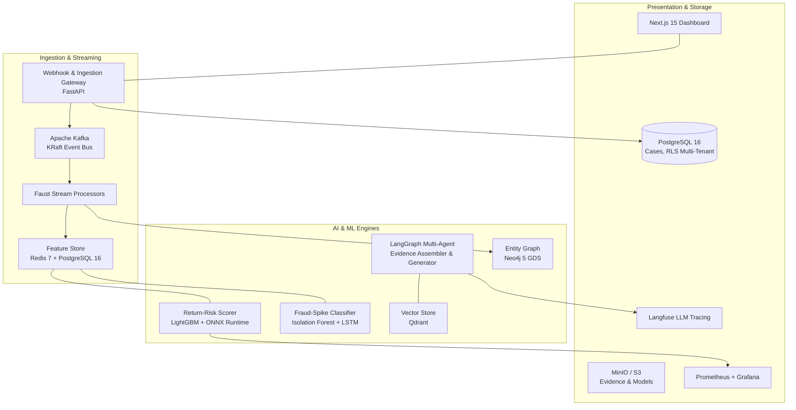

# AI Risk Manager

[](https://github.com/CosmicIon/AI-Risk-Manager/actions/workflows/ci.yml)
[](https://www.python.org/downloads/)
[](https://nextjs.org/)
[](https://fastapi.tiangolo.com/)
[](https://opensource.org/licenses/MIT)

> **Track 02 — BFSI Defense & Loss Prevention**  
> An enterprise-grade AI risk detection, scoring, and auto-responder platform built to protect merchants and financial institutions in Indian BFSI from **chargebacks, return abuse, fraud spikes, and coordinated abuse rings** — with explicit false-positive cost modeling and defense-only guarantees.

---

## Table of Contents

- [Key Objectives](#key-objectives)
- [Architecture Overview](#architecture-overview)
- [Core Risk Modules](#core-risk-modules)
- [Technology Stack](#technology-stack)
- [Prerequisites](#prerequisites)
- [Quickstart: Running Locally](#quickstart-running-locally)
  - [1. Clone and Configure](#1-clone-and-configure)
  - [2. Start Infrastructure Services](#2-start-infrastructure-services)
  - [3. Run Backend API](#3-run-backend-api)
  - [4. Run Next.js Dashboard](#4-run-nextjs-dashboard)
- [Testing & Quality Verification](#testing--quality-verification)
- [API Endpoints Reference](#api-endpoints-reference)
- [Evaluation & Cost-Weighted Loss](#evaluation--cost-weighted-loss)
- [Security, Compliance & Defense-Only Guardrails](#security-compliance--defense-only-guardrails)
- [Project Directory Structure](#project-directory-structure)

---

## Key Objectives

1. **Automate Chargeback Representment:** Assemble evidence across orders, 3DS logs, and delivery receipts, generate card-network-compliant narratives, and score win probabilities before strict network deadlines.
2. **Real-Time Return Risk Scoring:** Sub-100ms risk scoring for return requests with transparent SHAP explanations and merchant policy enforcement.
3. **Stream Anomaly Detection:** Detect transaction velocity spikes and distinguish organic sale events from fraud attacks.
4. **Abuse-Ring Sentinel:** Uncover coordinated fraud rings via Neo4j entity graphs and Louvain community detection.
5. **Measured Precision & Recall:** Rigorous model evaluation pipeline computing ₹-denominated false-positive and false-negative costs on versioned held-out datasets.

---

## Architecture Overview



---

## Core Risk Modules

### 1. Chargeback Evidence Responder
- **Trigger:** Webhook/file ingestion of Visa, Mastercard, and RuPay dispute notifications.
- **Workflow:** 
  - Resolves reason codes (`10.4`, `13.1`, `4837`, etc.) to specific evidence checklists.
  - Parallel agent tools retrieve proof of delivery, AVS matches, 3DS authentication logs, and IP geolocation.
  - LLM synthesizes structured representment narratives referencing verified evidence only.
  - ML confidence model scores win probability to guide human-in-the-loop sign-off.

### 2. Return-Risk Scorer
- **Trigger:** Synchronous return initiation requests (`POST /api/v1/returns/score`).
- **Engine:** LightGBM classifier served via ONNX Runtime (<5ms P99 inference latency).
- **Explainability:** Top-5 SHAP values translated into human-readable customer/analyst explanations.
- **Policy Engine:** Auto-approve, manual review, or auto-deny with customer lifetime value overrides.

### 3. Fraud-Spike Detector
- **Trigger:** Streaming transactions over Kafka.
- **Engine:** Ensemble of Isolation Forest (point anomalies) and LSTM Autoencoder (sequence anomalies).
- **Calendar-Aware Baselines:** Dynamic threshold adjustments for registered festival sales (e.g., Diwali, Big Billion Days) to minimize false positives.

### 4. Abuse-Ring Sentinel
- **Trigger:** Evolving transaction graph linking buyers, sellers, devices, addresses, and payment tokens.
- **Engine:** Louvain and Label Propagation community detection algorithms scoring suspicious clusters.

---

## Technology Stack

| Layer | Technologies |
|---|---|
| **Backend Runtime** | Python 3.12+ (AsyncIO, uvloop) |
| **API Framework** | FastAPI 0.115+, Pydantic v2, Uvicorn |
| **Frontend Framework** | Next.js 15 (App Router, Server Components, Vanilla CSS) |
| **Message Broker** | Apache Kafka 3.7 (KRaft mode) |
| **Stream Processing** | Faust 2 |
| **Primary Database** | PostgreSQL 16 (Row-Level Security for multi-tenancy) |
| **In-Memory Cache** | Redis 7 (Cluster & Rate Limiting) |
| **Vector Database** | Qdrant (Self-hosted for data localization) |
| **Graph Database** | Neo4j 5 Community with Graph Data Science (GDS) |
| **Object Storage** | MinIO (S3-compatible artifact storage) |
| **ML Inference** | ONNX Runtime, LightGBM, Scikit-Learn |
| **LLM Orchestration** | LangGraph, Google Gemini 2.5 Flash |
| **Explainability** | SHAP (TreeExplainer) |
| **Observability** | Langfuse, OpenTelemetry, Prometheus, Grafana |

---

## Prerequisites

Ensure you have the following installed on your host system:
- **Docker** and **Docker Compose** (v2.20+)
- **Python 3.12+** (with `pip` or `uv`)
- **Node.js 20+** and **npm** (for the Next.js dashboard)
- **Make** (optional, for CLI shortcuts)

---

## Quickstart: Running Locally

### 1. Clone and Configure

```bash
git clone https://github.com/CosmicIon/AI-Risk-Manager.git
cd AI-Risk-Manager

# Copy environment configuration
cp .env.example .env
```

Edit `.env` to configure your API keys (e.g., `GEMINI_API_KEY`, `LANGFUSE_PUBLIC_KEY`).

---

### 2. Start Infrastructure Services

Spin up PostgreSQL, Redis, Kafka, Qdrant, Neo4j, MinIO, and Langfuse in Docker:

```bash
# Using Makefile
make up

# Or directly with Docker Compose
docker compose -f infra/docker/docker-compose.yml up -d
```

Verify that all 7 services are healthy:
```bash
docker compose -f infra/docker/docker-compose.yml ps
```

| Service | Port | Description |
|---|---|---|
| **PostgreSQL** | `5432` | Relational database (`riskmanager`) |
| **Redis** | `6379` | Feature store & rate limit cache |
| **Kafka** | `9092` | Event bus (KRaft) |
| **Qdrant** | `6333` | Vector search UI & API |
| **Neo4j** | `7474`, `7687` | Browser & Bolt endpoint |
| **MinIO** | `9000`, `9001` | S3 API & Console (`minioadmin` / `minioadmin`) |
| **Langfuse** | `3001` | LLM observability dashboard |

---

### 3. Run Backend API

Set up a Python virtual environment and install backend dependencies:

```bash
cd backend
python -m venv .venv

# On Linux/macOS:
source .venv/bin/activate
# On Windows (PowerShell):
.\.venv\Scripts\Activate.ps1

# Install dependencies
pip install -e .
```

Start the FastAPI application with hot reload:

```bash
uvicorn src.main:app --reload --host 0.0.0.0 --port 8000
```

- **Interactive API Documentation (Swagger UI):** [http://localhost:8000/docs](http://localhost:8000/docs)
- **Alternative ReDoc UI:** [http://localhost:8000/redoc](http://localhost:8000/redoc)
- **Health Probe:** [http://localhost:8000/health](http://localhost:8000/health)

---

### 4. Run Next.js Dashboard

In a new terminal window:

```bash
cd dashboard
npm install
npm run dev
```

Open [http://localhost:3000](http://localhost:3000) in your browser to access the Risk Analyst Dashboard.

---

## Testing & Quality Verification

Run the test suite and code quality checks to verify **Module 0 (Scaffolding)** and **Module 1 (Data Contracts)** manually:

### Verify Module 0 (Infrastructure & FastAPI)

1. **Check Docker Services:** Ensure the 7 core infrastructure services are running.
   ```bash
   docker compose -f infra/docker/docker-compose.yml ps
   ```
2. **Check FastAPI Health Endpoints:**
   In a separate terminal, start the FastAPI server:
   ```bash
   cd backend
   .\.venv\Scripts\Activate.ps1
   uvicorn src.main:app --reload --host 0.0.0.0 --port 8000
   ```
   Then run:
   ```bash
   curl http://localhost:8000/health
   curl http://localhost:8000/readiness
   ```
   *Both should return a 200 OK JSON response.*

### Verify Module 1 (Data Contracts & Schemas)

1. **Run Pydantic and Avro Schema Tests:**
   This verifies all enums, data contracts, deadline computations, and `fastavro` schema parsing.
   ```bash
   cd backend
   .\.venv\Scripts\Activate.ps1
   pytest tests/unit/test_schemas.py -v --tb=short
   ```
   *You should see 8 passing tests.*

2. **Run Linting and Formatting Checks:**
   ```bash
   cd backend
   .\.venv\Scripts\Activate.ps1
   ruff check src/ tests/
   mypy src/
   ```

### Verify Dashboard Build
```bash
cd dashboard
npm run build
```

---

## API Endpoints Reference

### Health & Readiness
- `GET /health` — Liveness probe
- `GET /readiness` — Readiness probe for DB, Redis, Kafka, and Qdrant

### Return Risk Scoring
- `POST /api/v1/returns/score` — Real-time return risk scoring with SHAP breakdown
- `GET /api/v1/returns/history` — Historical return decisions with filtering
- `PUT /api/v1/returns/policy` — Update merchant risk thresholds and policy overrides

### Chargebacks
- `POST /api/v1/chargebacks/ingest` — Ingest card network dispute notification (idempotent via ARN)
- `GET /api/v1/chargebacks/{case_id}` — Full case detail with evidence checklist and draft narrative
- `POST /api/v1/chargebacks/{case_id}/review` — Approve, edit, or reject representment package
- `GET /api/v1/chargebacks/deadlines` — Cases approaching network deadlines (within 48 hours)

### Fraud & Graph Alerts
- `GET /api/v1/fraud/alerts` — Streaming anomaly detection alerts
- `POST /api/v1/fraud/events` — Register promotional calendar events for baseline adjustment
- `GET /api/v1/cases/stats` — Aggregated case statistics and win rates

---

## Evaluation & Cost-Weighted Loss

To satisfy strict financial ML requirements, models are evaluated not just on standard statistical metrics (Precision, Recall, F1, AUC-ROC), but on **Cost-Weighted Loss**:

$$\text{Cost-Weighted Loss} = \frac{(C_{\text{FP}} \times N_{\text{FP}}) + (C_{\text{FN}} \times N_{\text{FN}})}{N_{\text{total}}}$$

Where:
- $C_{\text{FP}}$ = ₹-denominated cost of a False Positive (e.g., blocking a loyal customer's legitimate return).
- $C_{\text{FN}}$ = ₹-denominated cost of a False Negative (e.g., unintercepted fraudulent return or lost chargeback).

Run the automated evaluation harness against versioned holdout test sets:

```bash
cd backend
python scripts/run_evaluation.py --model return_risk --version v1 --holdout v1 --fp-cost 500 --fn-cost 2000
```

---

## Security, Compliance & Defense-Only Guardrails

- **Strictly Defense-Only:** All endpoints and models are inference-only. The system contains no capabilities for synthetic identity creation, transaction spoofing, or attack pattern generation.
- **RBI Data Localization:** All state stores (Postgres, Qdrant, MinIO) run on-premises or in India-region VPCs without unencrypted cross-border data transfer.
- **PCI-DSS Level 1 Compliance:** PAN/CVV card data is never stored; only tokenized card references and masked network identifiers are processed.
- **Multi-Tenant Row-Level Security:** PostgreSQL Row-Level Security (RLS) ensures absolute isolation of merchant case data at the database engine level.
- **Prompt Injection Defense:** Strict input sanitization and sandboxed tool-calling for LLM evidence summarization.

---

## Project Directory Structure

```text
ai-risk-manager/
├── .github/workflows/          # CI/CD & Model Evaluation Pipelines
├── docs/                       # PRD, Tech Stack, Architecture & Todo Roadmap
│   ├── prd.md
│   ├── techstack.md
│   └── todo.md
├── backend/                    # Core Python / FastAPI Application
│   ├── src/
│   │   ├── api/                # REST endpoints & middleware
│   │   ├── core/               # Pydantic schemas, enums, exceptions
│   │   ├── db/                 # SQLAlchemy models & repositories
│   │   ├── ml/                 # LightGBM, ONNX, SHAP, evaluation harness
│   │   ├── agents/             # LangGraph chargeback response agents
│   │   ├── streaming/          # Faust Kafka stream processors
│   │   └── integrations/       # Redis, Qdrant, MinIO, LLM, Langfuse
│   └── tests/                  # Unit, integration, and evaluation test suites
├── dashboard/                  # Next.js 15 Web Dashboard
│   └── src/app/                # React App Router pages & UI components
├── infra/                      # Docker & container orchestration
│   └── docker/                 # docker-compose.yml & Dockerfiles
├── data/                       # Avro schemas & dataset artifacts
└── Makefile                    # Development workflow shortcuts
```

---

## License

This project is licensed under the MIT License — see the [LICENSE](LICENSE) file for details.

## Module 2 Verification
To manually verify the RLS isolation and repository layer for Module 2, run the verification script:
```bash
cd backend
.\.venv\Scripts\python.exe scripts\verify_module2.py
```
