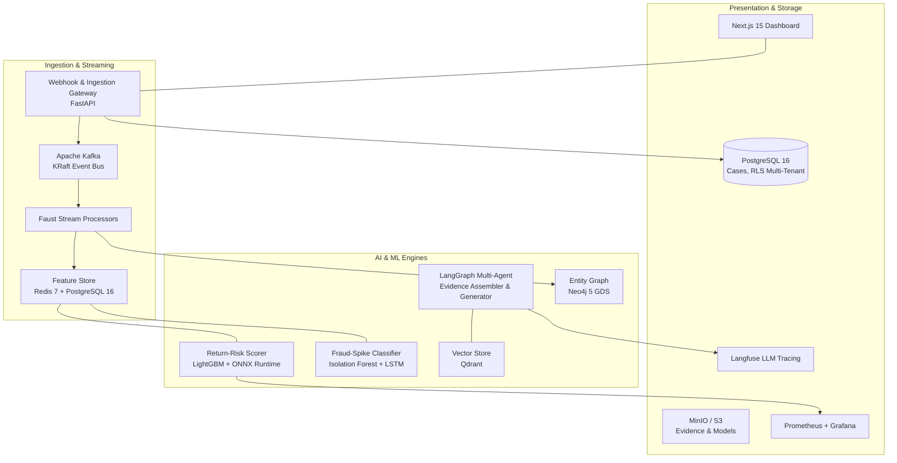

# AI Risk Manager

[](https://github.com/CosmicIon/AI-Risk-Manager/actions/workflows/ci.yml)
[](https://www.python.org/downloads/)
[](https://nextjs.org/)
[](https://fastapi.tiangolo.com/)
[](https://opensource.org/licenses/MIT)

> **Track 02 — BFSI Defense & Loss Prevention**  
> An enterprise-grade AI risk detection, scoring, and auto-responder platform built to protect merchants and financial institutions in Indian BFSI from **chargebacks, return abuse, fraud spikes, and coordinated abuse rings** — with explicit false-positive cost modeling and defense-only guarantees.

---

## Table of Contents

- [Key Objectives](#key-objectives)
- [The Industry Problem (What It Fixes)](#the-industry-problem-what-it-fixes)
- [Why Use This Project?](#why-use-this-project)
- [Risk Analyst Dashboard Guide](#risk-analyst-dashboard-guide)
- [Core Risk Modules](#core-risk-modules)
- [Architecture Overview](#architecture-overview)
- [Technology Stack](#technology-stack)
- [Prerequisites](#prerequisites)
- [Quickstart: Running Locally](#quickstart-running-locally)
- [Testing & Quality Verification](#testing--quality-verification)
- [API Endpoints Reference](#api-endpoints-reference)
- [Evaluation & Cost-Weighted Loss](#evaluation--cost-weighted-loss)
- [Security, Compliance & Guardrails](#security-compliance--guardrails)
- [Project Directory Structure](#project-directory-structure)

---

## Key Objectives

1. **Automate Chargeback Representment:** Assemble evidence across orders, 3DS logs, and delivery receipts, generate card-network-compliant narratives, and score win probabilities before strict network deadlines.
2. **Real-Time Return Risk Scoring:** Sub-100ms risk scoring for return requests with transparent SHAP explanations and merchant policy enforcement.
3. **Stream Anomaly Detection:** Detect transaction velocity spikes and distinguish organic sale events from fraud attacks.
4. **Abuse-Ring Sentinel:** Uncover coordinated fraud rings via Neo4j entity graphs and Louvain community detection.
5. **Measured Precision & Recall:** Rigorous model evaluation pipeline computing ₹-denominated false-positive and false-negative costs on versioned held-out datasets.

---

## The Industry Problem (What It Fixes)

In the modern e-commerce, Fintech, and digital payments landscape, merchants and payment aggregators face sophisticated fraud typologies that outpace traditional rules-based engines.

**Real-Life BFSI Problems Solved:**
1. **Chargeback SLA Breaches:** When a cardholder initiates a dispute (e.g., Visa Reason Code 10.4 "Other Fraud"), merchants have a strict, non-negotiable window (often 20-30 days) to submit "representment" packages. Manually gathering AVS checks, 3DS authentication logs, and IP geolocation proof takes days. Missed network deadlines result in automatic financial liability and increased chargeback ratios (which can lead to acquiring bank fines).
2. **Static & Vulnerable Return Policies:** Retailers typically treat all returns equally to reduce friction. Legitimate buyers suffer from delayed refunds, while organized return-fraud rings exploit systemic loopholes to return counterfeit goods (Wardrobing/Bricking). Static rule engines cannot adapt dynamically to evolving abuse patterns.
3. **Siloed Data Leading to Unseen Connections:** Fraudsters operate in orchestrated rings—using synthetic identities, rotating IPs, and shared drop-shipping addresses. Relational databases view transactions in isolation, failing to connect a new fraudulent transaction to a previously known bad actor via a shared device fingerprint.
4. **Black-Box ML Rejections:** Financial regulators (like the RBI) and customer support teams require transparent decision-making. Standard Deep Learning models output opaque "reject" scores, leaving human analysts unable to justify an account block to a frustrated customer or compliance auditor.

---

## Why Use This Project?

**AI Risk Manager** bridges the gap between raw data engineering and operational risk management. It is designed to be deployed directly into a merchant's payment or order management flow.

- **Stop Revenue Leaks via Autonomous Agents:** Replace error-prone manual chargeback reviews with LangGraph agents that query disparate databases, assemble proof, and auto-generate network-compliant dispute narratives in seconds.
- **Dynamic Risk Friction:** Score return and refund requests in real-time (<100ms inference). Fast-track refunds for high-LTV, loyal customers while routing high-risk requests for manual review or outright denial.
- **Explainable AI (XAI) at the Core:** Every ML decision is accompanied by a SHAP (SHapley Additive exPlanations) breakdown, translating complex tree-based decisions into human-readable insights (e.g., *"Velocity of purchases in the last 1 hour is 5x higher than normal"*).
- **Financial Rigor (Cost-Weighted Loss):** In BFSI, false positives (blocking a good customer) and false negatives (allowing a fraudster) have vastly different financial impacts. The platform evaluates models based on actual ₹ impact, dynamically thresholding approvals based on the average order value.

---

## Risk Analyst Dashboard Guide

The Next.js 15 dashboard is the operational command center for Risk Analysts. It provides a highly responsive, dark-mode interface designed for high-throughput case resolution.

### 1. Dashboard Home (Overview)
- **Purpose:** A high-level operational snapshot of the organization's risk exposure.
- **Cost-Weighted Chart:** Tracks the financial efficiency of the ML models over the week. It maps Precision/Recall against actual ₹ loss prevented vs. ₹ lost to false positives.
- **Case Distribution:** A dynamic Recharts pie chart breaking down active risk vectors (Chargebacks, Returns, Fraud Alerts, Abuse Rings).
- **Audit Feed:** A real-time log of the most critical events requiring immediate analyst attention (e.g., impending Visa/Mastercard deadlines).

### 2. Chargebacks Module
- **Purpose:** Dispute lifecycle management and representment generation.
- **How to Use It:** 
  - The module displays a Kanban-style list of active chargeback disputes prioritized by Card Network deadlines.
  - Analysts click into a **Case Detail View**. By the time the analyst opens the case, the backend LangGraph AI Agent has already aggregated Proof of Delivery, IP matches, and drafted a **Representment Narrative**.
  - The analyst reviews the draft for accuracy, edits if necessary, and clicks **Submit to Network** to fight the dispute, or **Accept Liability** if the evidence is insufficient.

### 3. Return Scoring Module
- **Purpose:** Real-time visibility into customer return/refund requests.
- **How to Use It:**
  - Displays a live feed of requests with their ML-assigned risk scores (0-100).
  - **Color-Coded Tiers:** Green (Low Risk / Auto-Approve), Yellow (Medium Risk / Human Review), Red (High Risk / Auto-Deny).
  - **SHAP Explanations:** Clicking a specific request expands the view to reveal the exact features that drove the score (e.g., *"Customer lifetime value is low"* combined with *"IP distance from shipping address > 500km"*).

### 4. Fraud Alerts Module
- **Purpose:** Monitoring of streaming anomalies detected via the Kafka/Faust pipeline.
- **How to Use It:**
  - Analysts view sudden transaction velocity spikes.
  - Includes a **Calendar Adjustments** feature. Analysts can register events like "Diwali Flash Sale" or "Big Billion Days" to dynamically adjust the AI's baseline expectations, preventing legitimate traffic spikes from generating thousands of false-positive alerts.

---

## Core Risk Modules

### 1. Chargeback Evidence Responder
- **Trigger:** Webhook/file ingestion of Visa, Mastercard, and RuPay dispute notifications.
- **Workflow:** 
  - Resolves reason codes (`10.4`, `13.1`, `4837`, etc.) to specific evidence checklists.
  - Parallel agent tools retrieve proof of delivery, AVS matches, 3DS authentication logs, and IP geolocation.
  - LLM synthesizes structured representment narratives referencing verified evidence only.
  - ML confidence model scores win probability to guide human-in-the-loop sign-off.

### 2. Return-Risk Scorer
- **Trigger:** Synchronous return initiation requests (`POST /api/v1/returns/score`).
- **Engine:** LightGBM classifier served via ONNX Runtime (<5ms P99 inference latency).
- **Explainability:** Top-5 SHAP values translated into human-readable customer/analyst explanations.
- **Policy Engine:** Auto-approve, manual review, or auto-deny with customer lifetime value overrides.

### 3. Fraud-Spike Detector
- **Trigger:** Streaming transactions over Kafka.
- **Engine:** Ensemble of Isolation Forest (point anomalies) and LSTM Autoencoder (sequence anomalies).
- **Calendar-Aware Baselines:** Dynamic threshold adjustments for registered festival sales to minimize false positives.

### 4. Abuse-Ring Sentinel
- **Trigger:** Evolving transaction graph linking buyers, sellers, devices, addresses, and payment tokens.
- **Engine:** Louvain and Label Propagation community detection algorithms scoring suspicious clusters in Neo4j.

### 5. Fraud Detection Simulation Studio
- **Trigger:** On-demand dataset generation or live WebSocket streaming via `/api/v1/simulation`.
- **Engine:** Vectorized NumPy/Pandas generating high-throughput datasets with $O(N \log N)$ geographic terminal binding via `scipy.spatial.cKDTree`.
- **Scenarios:** Faithfully adapts the *Fraud Detection Handbook*, injecting High Amount point-fraud, POS Skimming windows, and Account Takeovers.
- **Dashboard:** Interactive HTML5 Canvas mapping a 100x100km spatial grid, with a live streaming transaction ticker and Recharts KPI analytics.

---

## Architecture Overview



---

## Technology Stack

| Layer | Technologies |
|---|---|
| **Backend Runtime** | Python 3.12+ (AsyncIO, uvloop) |
| **API Framework** | FastAPI 0.115+, Pydantic v2, Uvicorn |
| **Frontend Framework** | Next.js 15 (App Router, Server Components, Vanilla CSS) |
| **Message Broker** | Apache Kafka 3.7 (KRaft mode) |
| **Stream Processing** | Faust 2 |
| **Primary Database** | PostgreSQL 16 (Row-Level Security for multi-tenancy) |
| **In-Memory Cache** | Redis 7 (Cluster & Rate Limiting) |
| **Vector Database** | Qdrant (Self-hosted for data localization) |
| **Graph Database** | Neo4j 5 Community with Graph Data Science (GDS) |
| **Object Storage** | MinIO (S3-compatible artifact storage) |
| **ML Inference** | ONNX Runtime, LightGBM, Scikit-Learn |
| **LLM Orchestration** | LangGraph, Google Gemini 2.5 Flash |
| **Explainability** | SHAP (TreeExplainer) |
| **Observability** | Langfuse, OpenTelemetry, Prometheus, Grafana |

---

## Prerequisites

Ensure you have the following installed on your host system:
- **Docker** and **Docker Compose** (v2.20+)
- **Python 3.12+** (with `pip` or `uv`)
- **Node.js 20+** and **npm** (for the Next.js dashboard)
- **Make** (optional, for CLI shortcuts)

---

## Quickstart: Running Locally

### 1. Clone and Configure

```bash
git clone https://github.com/CosmicIon/AI-Risk-Manager.git
cd AI-Risk-Manager

# Copy environment configuration
cp .env.example .env
```

Edit `.env` to configure your API keys (e.g., `GEMINI_API_KEY`, `LANGFUSE_PUBLIC_KEY`).

---

### 2. Start Infrastructure Services

Spin up PostgreSQL, Redis, Kafka, Qdrant, Neo4j, MinIO, and Langfuse in Docker:

```bash
# Using Makefile
make up

# Or directly with Docker Compose
docker compose -f infra/docker/docker-compose.yml up -d
```

Verify that all 7 services are healthy:
```bash
docker compose -f infra/docker/docker-compose.yml ps
```

| Service | Port | Description |
|---|---|---|
| **PostgreSQL** | `5432` | Relational database (`riskmanager`) |
| **Redis** | `6379` | Feature store & rate limit cache |
| **Kafka** | `9092` | Event bus (KRaft) |
| **Qdrant** | `6333` | Vector search UI & API |
| **Neo4j** | `7474`, `7687` | Browser & Bolt endpoint |
| **MinIO** | `9000`, `9001` | S3 API & Console (`minioadmin` / `minioadmin`) |
| **Langfuse** | `3001` | LLM observability dashboard |

---

### 3. Run Backend API

Set up a Python virtual environment and install backend dependencies:

```bash
cd backend
python -m venv .venv

# On Linux/macOS:
source .venv/bin/activate
# On Windows (PowerShell):
.\.venv\Scripts\Activate.ps1

# Install dependencies
pip install -e .
```

Start the FastAPI application with hot reload:

```bash
uvicorn src.main:app --reload --host 0.0.0.0 --port 8000
```

- **Interactive API Documentation (Swagger UI):** [http://localhost:8000/docs](http://localhost:8000/docs)
- **Alternative ReDoc UI:** [http://localhost:8000/redoc](http://localhost:8000/redoc)
- **Health Probe:** [http://localhost:8000/health](http://localhost:8000/health)

---

### 4. Run Next.js Dashboard

In a new terminal window:

```bash
cd dashboard
npm install
npm run dev
```

Open [http://localhost:3000](http://localhost:3000) in your browser to access the Risk Analyst Dashboard.

---

## Testing & Quality Verification

Run the test suites and code quality checks to verify the completed modules manually:

### Verify Module 0 (Infrastructure & FastAPI)
1. **Check Docker Services:** Ensure the core infrastructure services are running.
   ```bash
   docker compose -f infra/docker/docker-compose.yml ps
   ```
2. **Check FastAPI Health Endpoints:**
   In a separate terminal, start the FastAPI server:
   ```bash
   cd backend
   .\.venv\Scripts\Activate.ps1
   uvicorn src.main:app --reload --host 0.0.0.0 --port 8000
   ```
   Then run:
   ```bash
   curl http://localhost:8000/health
   curl http://localhost:8000/readiness
   ```
   *Both should return a 200 OK JSON response.*

### Verify Module 1 (Data Contracts & Schemas)
1. **Run Pydantic and Avro Schema Tests:**
   This verifies all enums, data contracts, deadline computations, and `fastavro` schema parsing.
   ```bash
   cd backend
   .\.venv\Scripts\Activate.ps1
   pytest tests/unit/test_schemas.py -v --tb=short
   ```
2. **Run Linting and Formatting Checks:**
   ```bash
   cd backend
   .\.venv\Scripts\Activate.ps1
   ruff check src/ tests/
   mypy src/
   ```

### Verify Module 2 (Database & Persistence)
To manually verify the RLS isolation and repository layer for Module 2, run the verification script:
```bash
cd backend
.\.venv\Scripts\python.exe scripts\verify_module2.py
```

### Verify Module 3 (Integrations)
To verify the typed clients (Redis, Kafka, Qdrant, MinIO, LLM):
```bash
cd backend
.\.venv\Scripts\Activate.ps1
pytest tests/integration/ -v
pytest tests/unit/test_llm_client.py -v
```

### Verify Module 4 (ML Models & Serving)
To test the synthetic data generation, ONNX Runtime serving, and SHAP explainability:
```bash
cd backend
.\.venv\Scripts\Activate.ps1
# Generate synthetic data
python scripts/generate_synthetic_data.py
# Run the verification script
$env:PYTHONPATH="."; python -m scripts.verify_module_4
# Run the ML unit tests
pytest tests/unit/test_feature_engineering.py tests/unit/test_return_scoring.py tests/unit/test_fraud_detection.py -v
```

### Verify Module 5 (Evaluation Harness & Drift Detection)
To manually verify the cost-weighted loss metrics and evaluation pipeline:
```bash
cd backend
.\.venv\Scripts\Activate.ps1
pytest tests/evaluation/ -v
# Run the evaluation CLI to simulate a CI gate check
python scripts/run_evaluation.py --model-name return_risk --model-version v1 --holdout-version v1 --fp-cost 500 --fn-cost 2000
```

### Verify Module 6 (Streaming Pipeline & Feature Store)
To verify tumbling windows, Redis feature persistence, anomaly detection, and graph mutations:
```bash
cd backend
.\.venv\Scripts\Activate.ps1
pytest tests/integration/test_kafka_pipeline.py -v
```

### Verify Module 7 (AI Agent Pipeline)
To manually verify the LangGraph multi-agent pipeline for chargeback evidence assembly:
```bash
cd backend
.\.venv\Scripts\Activate.ps1
pytest tests/integration/test_agent_pipeline.py -v
```

### Verify Module 8 (Service Layer)
```bash
cd backend
.\.venv\Scripts\Activate.ps1
pytest tests/unit/test_services.py -v
```

### Verify Module 9 (REST API Layer & Middleware)
```bash
cd backend
.\.venv\Scripts\Activate.ps1
pytest tests/integration/test_api_chargebacks.py -v
pytest tests/integration/test_api_returns.py -v
```

### Verify Module 10 (Graph Analysis / Abuse-Ring Sentinel)
To manually verify the Neo4j graph pipeline and Louvain community detection:
```bash
cd backend
.\.venv\Scripts\Activate.ps1
pytest tests/integration/test_graph_analysis.py -v
```

### Verify Module 11 (Observability & Monitoring)
```bash
# Restart the infra stack to include Prometheus and Grafana
docker-compose -f infra/docker/docker-compose.yml up -d prometheus grafana

# Check the Prometheus metrics endpoint
curl -s http://localhost:8000/api/v1/metrics/prometheus | Select-String -Pattern "requests_total|return_scoring_latency"
```

### Verify Module 13 (End-to-End Integration Tests)
Run the full E2E test suite covering all major business flows:
```bash
cd backend
python -m pytest tests/integration/test_e2e_chargeback_flow.py \
                 tests/integration/test_e2e_return_scoring_flow.py \
                 tests/integration/test_e2e_fraud_detection_flow.py \
                 tests/integration/test_e2e_evaluation_flow.py -v --tb=short
# Expected: 28 tests pass
```
Or run the **entire test suite** end-to-end:
```bash
cd backend
python -m pytest tests/ -v --tb=short
```

---

## API Endpoints Reference

### Health & Readiness
- `GET /health` — Liveness probe
- `GET /readiness` — Readiness probe for DB, Redis, Kafka, and Qdrant

### Return Risk Scoring
- `POST /api/v1/returns/score` — Real-time return risk scoring with SHAP breakdown
- `GET /api/v1/returns/history` — Historical return decisions with filtering
- `PUT /api/v1/returns/policy` — Update merchant risk thresholds and policy overrides

### Chargebacks
- `POST /api/v1/chargebacks/ingest` — Ingest card network dispute notification (idempotent via ARN)
- `GET /api/v1/chargebacks/{case_id}` — Full case detail with evidence checklist and draft narrative
- `POST /api/v1/chargebacks/{case_id}/review` — Approve, edit, or reject representment package
- `GET /api/v1/chargebacks/deadlines` — Cases approaching network deadlines (within 48 hours)

### Fraud & Graph Alerts
- `GET /api/v1/fraud/alerts` — Streaming anomaly detection alerts
- `POST /api/v1/fraud/events` — Register promotional calendar events for baseline adjustment
- `GET /api/v1/cases/stats` — Aggregated case statistics and win rates

---

## Evaluation & Cost-Weighted Loss

To satisfy strict financial ML requirements, models are evaluated not just on standard statistical metrics (Precision, Recall, F1, AUC-ROC), but on **Cost-Weighted Loss**:

$$\text{Cost-Weighted Loss} = \frac{(C_{\text{FP}} \times N_{\text{FP}}) + (C_{\text{FN}} \times N_{\text{FN}})}{N_{\text{total}}}$$

Where:
- $C_{\text{FP}}$ = ₹-denominated cost of a False Positive (e.g., blocking a loyal customer's legitimate return).
- $C_{\text{FN}}$ = ₹-denominated cost of a False Negative (e.g., unintercepted fraudulent return or lost chargeback).

Run the automated evaluation harness against versioned holdout test sets:
```bash
cd backend
python scripts/run_evaluation.py --model-name return_risk --model-version v1 --holdout-version v1 --fp-cost 500 --fn-cost 2000
```

---

## Security, Compliance & Guardrails

- **Strictly Defense-Only:** All endpoints and models are inference-only. The system contains no capabilities for synthetic identity creation, transaction spoofing, or attack pattern generation.
- **RBI Data Localization:** All state stores (Postgres, Qdrant, MinIO) run on-premises or in India-region VPCs without unencrypted cross-border data transfer.
- **PCI-DSS Level 1 Compliance:** PAN/CVV card data is never stored; only tokenized card references and masked network identifiers are processed.
- **Multi-Tenant Row-Level Security:** PostgreSQL Row-Level Security (RLS) ensures absolute isolation of merchant case data at the database engine level.
- **Prompt Injection Defense:** Strict input sanitization and sandboxed tool-calling for LLM evidence summarization.

---

## Project Directory Structure

```text
ai-risk-manager/
├── .github/workflows/          # CI/CD & Model Evaluation Pipelines
├── docs/                       # PRD, Tech Stack, Architecture & Todo Roadmap
│   ├── prd.md
│   ├── techstack.md
│   └── todo.md
├── backend/                    # Core Python / FastAPI Application
│   ├── src/
│   │   ├── api/                # REST endpoints & middleware
│   │   ├── core/               # Pydantic schemas, enums, exceptions
│   │   ├── db/                 # SQLAlchemy models & repositories
│   │   ├── ml/                 # LightGBM, ONNX, SHAP, evaluation harness
│   │   ├── agents/             # LangGraph chargeback response agents
│   │   ├── streaming/          # Faust Kafka stream processors
│   │   └── integrations/       # Redis, Qdrant, MinIO, LLM, Langfuse
│   └── tests/                  # Unit, integration, and evaluation test suites
├── dashboard/                  # Next.js 15 Web Dashboard
│   └── src/app/                # React App Router pages & UI components
├── infra/                      # Docker & container orchestration
│   └── docker/                 # docker-compose.yml & Dockerfiles
├── data/                       # Avro schemas & dataset artifacts
└── Makefile                    # Development workflow shortcuts
```

---

## License

This project is licensed under the MIT License — see the [LICENSE](LICENSE) file for details.
