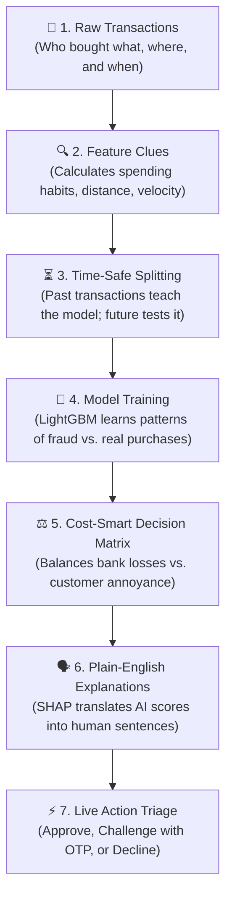

# 🌊 End-to-End Data Flow Explained Simply

If you've ever wondered **"What happens to transaction data from the moment someone swipes a card to the moment fraud is detected?"**, this document explains the whole journey in simple, plain English—no complicated math or confusing jargon required.

> 🎤 **Preparing for a Demo or Presentation?** Check out [**`docs/FILES_EXPLAINED.md`**](FILES_EXPLAINED.md) for a file-by-file breakdown with 10-second pitch lines and answers to tough judge questions!

---

## 🧭 The Big Picture in 30 Seconds

Imagine you are a security officer at a busy shopping mall. Every time someone buys something, you need to answer one question in less than a blink of an eye: **"Is this a real customer, or a thief using a stolen card?"**

Here is how our project does that automatically:



---

## 🎬 A Real-Life Example: Follow Alice's $350 Transaction

To understand the steps, let's follow a single customer named **Alice**:

> **The Event:**  
> It's 2:15 AM on a Sunday. Alice's card is used at an electronics terminal 150 miles away from her home to buy a $350 gadget. Alice normally buys groceries for $25–$40 near her house in the afternoon.

Here is how our system processes Alice's transaction through the pipeline:

---

## 🪜 Step-by-Step Data Flow

### Step 1: Raw Data Collection & Ingestion
* **Python File:** [`src/ingestion.py`](file:///d:/CODING/github/AI-Risk-Manager/src/ingestion.py)
* **Input:** Customer profiles and terminal locations.
* **Output:** `data/raw/transactions.pkl`

#### What happens here?
At the start, the system collects raw transaction logs. Each transaction is very basic:
- `TRANSACTION_ID`: Unique receipt number (`#1058291`)
- `TX_DATETIME`: Date and time (`2026-09-04 02:15:00`)
- `CUSTOMER_ID`: Who swiped the card (`Customer #4821` - Alice)
- `TERMINAL_ID`: Which store/card machine was used (`Terminal #12049`)
- `TX_AMOUNT`: How much money was spent (`$350.00`)

In our project, we generate 180 days of realistic transaction history (1.75+ million purchases) and sprinkle in realistic fraud scenarios (like stolen cards, high-value midnight spending, and compromised terminals).

---

### Step 2: Extracting Clues (Feature Engineering)
* **Python File:** [`src/features.py`](file:///d:/CODING/github/AI-Risk-Manager/src/features.py)
* **Input:** Raw transaction table (`data/raw/transactions.pkl`)
* **Output:** Enriched feature table (`data/processed/features.parquet`)

#### What happens here?
Raw numbers like "$350" or "Customer #4821" don't tell the AI whether something is dangerous. We need to turn raw data into **contextual clues**:

1. **Spending Habits (Customer Profiles):**
   - *How much does Alice usually spend in a month?* (e.g. Average: $30)
   - *Z-Score:* Alice's $350 purchase is **10 times higher** than her normal variance.
2. **Speed & Velocity:**
   - *Did 3 transactions just happen in the last 15 minutes?* (A classic sign of automated card testing).
3. **Geography & Distance:**
   - *How far is this store from Alice's home address?* (Store is 150 miles away—unusual).
4. **Terminal Suspicion Level (with a 7-day delay):**
   - *Has this store terminal had lots of reported fraud recently?*  
   - ⚠️ **Smart Detail:** In the real world, fraud reports (chargebacks) take a week to reach the bank. So we look back with a 7-day delay so our AI doesn't unrealistically "peek" into the future.
5. **Time of Day:**
   - Is it the middle of the night (2:00 AM)? Yes = higher risk multiplier.

---

### Step 3: Time-Safe Data Splitting (No Cheating!)
* **Python File:** [`src/split.py`](file:///d:/CODING/github/AI-Risk-Manager/src/split.py)
* **Input:** `data/processed/features.parquet`
* **Output:** `train.parquet` (Days 30–120) and `test.parquet` (Days 127–180)

#### What happens here?
In machine learning, you must never test a model on data it has already seen. But in fraud detection, there is a bigger danger: **Time Leakage**.

```
[ Day 30 ---------- Day 120 ]   [ Day 121 -- 126 ]   [ Day 127 ---------- Day 180 ]
        TRAINING SET              7-DAY EMBARGO BUFFER            TEST SET
    (Model learns patterns)        (Cooling-off gap)       (Simulates the real future)
```

1. **Training Set (Days 30–120):** Used to teach the AI what normal customers and fraudsters look like.
2. **7-Day Embargo Buffer (Days 121–126):** We completely throw away this 7-day slice! Why? Because fraud committed on Day 120 hasn't been discovered yet on Day 121. Giving the model a cooling-off gap prevents it from "cheating".
3. **Test Set (Days 127–180):** Represents brand new, unseen future transactions to verify how well the model works in the real world.

---

### Step 4: Model Training & Hyperparameter Tuning
* **Python Files:** [`src/train.py`](file:///d:/CODING/github/AI-Risk-Manager/src/train.py), [`src/tune.py`](file:///d:/CODING/github/AI-Risk-Manager/src/tune.py), [`src/cross_validate.py`](file:///d:/CODING/github/AI-Risk-Manager/src/cross_validate.py)
* **Input:** `data/processed/train.parquet`
* **Output:** Trained model file `models/model.pkl`

#### What happens here?
- Out of 1,000 transactions, usually 993 are legal and only 7 are fraud (less than 1%). If a dumb model simply guessed "Legal" every time, it would be 99.3% accurate—but the bank would lose millions!
- We train an ultra-fast gradient boosting algorithm called **LightGBM** and give heavy mathematical weight to fraud examples (`scale_pos_weight`) so the model pays intense attention to suspicious clues.
- We validate across multiple rolling time windows (**Walk-Forward Cross-Validation**) to ensure the model stays reliable month after month.

---

### Step 5: Cost-Smart Decision & Triage Thresholds
* **Python File:** [`src/evaluate.py`](file:///d:/CODING/github/AI-Risk-Manager/src/evaluate.py)
* **Input:** `data/processed/test.parquet` + `models/model.pkl`
* **Output:** `models/metrics_test.json` & visual reports

#### What happens here?
Most machine learning tutorials say: *"If probability > 50%, flag it."*  
In real finance, **50% is the wrong threshold**.

There are real dollars attached to every mistake:
- **False Alarm (False Positive):** An innocent customer is blocked. It costs the bank roughly **$5.00** in customer support calls and lost trust.
- **Missed Fraud (False Negative):** A criminal steals goods. The bank loses the entire purchase value (e.g. **$128.44** on average) plus chargeback fines.

Our evaluation script sweeps 99 different cutoff points to find the **exact threshold that loses the least money**:
- In our system, the optimal high-risk cutoff is **0.78**.
- We use a **3-Tier Triage Policy**:
  1. 🟢 **Risk Score < 0.30 (APPROVE):** Normal swipe. Instant frictionless checkout.
  2. 🟡 **Risk Score 0.30 to 0.78 (CHALLENGE):** Send an instant SMS/App One-Time Passcode (OTP). Real customers enter the code and move on; thieves cannot.
  3. 🔴 **Risk Score ≥ 0.78 (DECLINE):** Hard stop or immediate manual review by a fraud investigator.

---

### Step 6: Plain-English Explainability (XAI)
* **Python File:** [`src/explain.py`](file:///d:/CODING/github/AI-Risk-Manager/src/explain.py)
* **Input:** Suspicious transaction feature vector
* **Output:** Human-readable explanations for risk analysts

#### What happens here?
No bank analyst wants to look at complicated formulas or raw math weights like `+1.84 SHAP log-odds on feature #12`.  
Our explainability engine automatically translates the math into human words:

- ❌ *Math:* `TX_AMOUNT_ZSCORE = 4.2`  
  👉 **Plain English:** *"This amount ($350.00) is significantly higher than what this customer normally spends."*
- ❌ *Math:* `DIST_CUSTOMER_TERMINAL = 150.2`  
  👉 **Plain English:** *"Card used 150 miles away from customer's primary address."*
- ❌ *Math:* `TX_DURING_NIGHT = 1`  
  👉 **Plain English:** *"Transaction occurred during high-risk late-night hours (2:15 AM)."*

---

### Step 7: Real-Time Checkout API (FastAPI)
* **Python File:** [`src/api.py`](file:///d:/CODING/github/AI-Risk-Manager/src/api.py)
* **Input:** Incoming JSON POST request from payment gateway
* **Output:** Fast JSON decision in under 50 milliseconds

When Alice's card is tapped at the payment terminal, the merchant gateway calls our API:

```json
// Incoming Request to POST /v1/risk/evaluate
{
  "transaction_id": 1058291,
  "customer_id": 4821,
  "terminal_id": 12049,
  "tx_amount": 350.00,
  "tx_datetime": "2026-09-04T02:15:00"
}
```

In less than 20 milliseconds, our API runs the feature calculations, queries the model, and responds:

```json
// Outgoing Response
{
  "transaction_id": 1058291,
  "risk_score": 0.884,
  "decision": "DECLINE",
  "latency_ms": 14.2,
  "reasons": [
    "This amount is significantly higher than customer's 30-day average",
    "Card used unusually far from customer home location",
    "High-risk overnight transaction window"
  ]
}
```

---

### Step 8: Executive Dashboard & Live Operations
* **Python File:** [`src/dashboard.py`](file:///d:/CODING/github/AI-Risk-Manager/src/dashboard.py)
* **How to run:** `streamlit run src/dashboard.py`

#### What happens here?
Risk managers and executives open an interactive web portal to:
- See the **Executive Verdict**: (e.g. *"Intercepts 97% of fraud while clearing 99.4% of legitimate volume"*).
- Adjust the **Live Threshold Slider** to see how changing policies affects profits and customer friction in real time.
- View the **Live Flagged Feed** with plain-English reasons for every flagged swipe.

---

### Step 9: Drift & Health Monitoring
* **Python File:** [`src/drift.py`](file:///d:/CODING/github/AI-Risk-Manager/src/drift.py)
* **Input:** Training data vs. recent production transactions
* **Output:** `reports/drift_report.md`

#### What happens here?
Fraudsters constantly change tactics, and customer spending changes with holidays or inflation.  
The drift monitor calculates the **Population Stability Index (PSI)**. If spending habits shift significantly ($\text{PSI} > 0.25$), an alert is triggered advising the team to retrain the model.

---

## 📊 Summary Matrix: Inputs & Outputs at Each Stage

| Stage | Main Script | What goes IN? | What comes OUT? | Everyday Analogy |
| :--- | :--- | :--- | :--- | :--- |
| **1. Ingestion** | `ingestion.py` | Configuration settings (`config.yaml`) | Raw transaction receipts (`transactions.pkl`) | Cash register printing paper receipts |
| **2. Features** | `features.py` | Raw receipts | Deep history & behavior metrics (`features.parquet`) | Detective looking into the customer's background |
| **3. Split** | `split.py` | Feature table | Train & Test sets with a 7-day buffer | Studying textbooks from last year to take this year's test |
| **4. Train** | `train.py`, `tune.py` | Training transactions | Trained decision model (`model.pkl`) | Training a guard dog to recognize bad smells |
| **5. Evaluate** | `evaluate.py` | Test transactions + Model | Best threshold & cost report (`metrics_test.json`) | Finding the sweet spot between safety and convenience |
| **6. Explain** | `explain.py` | Suspicious transaction | Clear bullet points explaining why | Guard explaining to the manager why an alarm was pulled |
| **7. API** | `api.py` | Real-time card swipe JSON | Instant verdict (`APPROVE` / `CHALLENGE` / `DECLINE`) | The electronic gate opening or closing at checkout |
| **8. Dashboard** | `dashboard.py` | Model + Test sample | Interactive visual cockpit | Control room monitors for airport security chiefs |
| **9. Drift** | `drift.py` | Training vs. Recent swipes | Health report on feature stability | Routine checkup to see if security procedures are outdated |

---

## 💡 Quick Glossary (In Plain Words)

- **Chargeback:** When a customer calls their bank and says *"I didn't buy that!"*, and the bank forces the merchant to refund the money plus pay a penalty fee.
- **False Positive (False Alarm):** When the AI flags an innocent, honest customer by mistake.
- **False Negative (Missed Fraud):** When a thief gets away with stolen money because the AI didn't catch them.
- **Embargo Buffer:** A short time gap placed between training and testing data so delayed fraud reports don't leak into the past.
- **SHAP (Explainability):** A mathematical tool that breaks down a score into individual contributions (e.g. +30% risk from midnight hour, +40% risk from unusual dollar amount).
- **Z-Score:** A score measuring how far an amount is from someone's regular average (e.g. buying a $500 TV when you usually buy $10 lunches).
