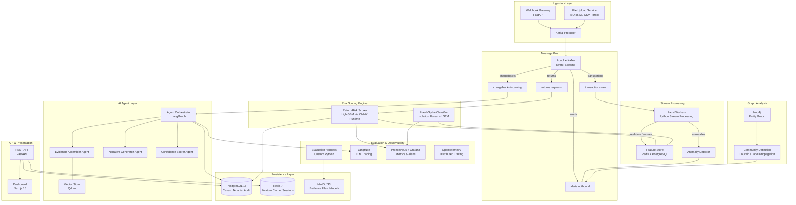
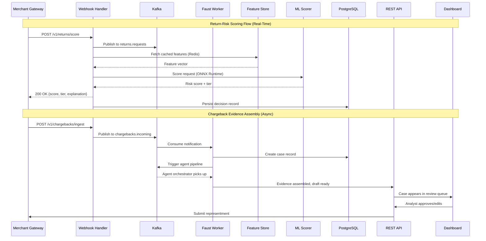
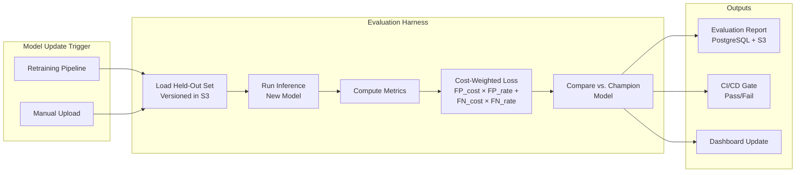

# AI Risk Manager — Technology Stack & Architecture

## 1. System Architecture

### 1.1 High-Level Architecture Diagram



### 1.2 Data Flow Diagram



---

## 2. Technology Selections & Rationales

### 2.1 Languages & Runtimes

| Technology | Usage | Rationale |
|---|---|---|
| **Python 3.12** | Backend services, ML pipelines, stream processing, agent orchestration | Dominant ecosystem for ML/AI (scikit-learn, LightGBM, LangGraph, ONNX). Async support via `asyncio` + `uvloop` for high-throughput API serving. |
| **TypeScript / Node.js 22** | Dashboard frontend (Next.js) | React ecosystem maturity; server components for dashboard SSR; strong typing for complex UI state. |
| **SQL** | Database queries, analytics | PostgreSQL's advanced JSON, window functions, and CTEs are critical for time-series feature queries. |

### 2.2 Core Frameworks

| Technology | Component | Rationale |
|---|---|---|
| **FastAPI 0.115+** | REST API, Webhook Gateway | Async-native, automatic OpenAPI docs, Pydantic v2 integration for strict schema validation at service boundaries. Sub-ms routing overhead. |
| **Next.js 15 (App Router)** | Dashboard UI | Server Components for data-heavy dashboard views; streaming SSR for real-time metrics; built-in API routes for BFF (Backend-for-Frontend) pattern. |
| **Faust 2 (robinhood/faust)** | Stream processing | Python-native Kafka stream processing; allows reuse of Python ML code in stream context; tables for stateful aggregations (velocity counters, sliding windows). |
| **Celery 5 + Redis** | Async task queue | For long-running tasks (evidence assembly, batch retraining) that don't fit the stream processing model. Priority queues for deadline-based chargeback processing. |
| **Pydantic v2** | Data validation everywhere | Every service boundary enforces typed schemas. Rust-powered core gives 5-50x validation speedup over v1. |

### 2.3 ML / AI Stack

| Technology | Component | Rationale |
|---|---|---|
| **LightGBM** | Return-risk scorer, chargeback win-probability scorer | Best-in-class for tabular data with class imbalance (scale_pos_weight). Handles categorical features natively. Inference time <1ms per sample. |
| **ONNX Runtime** | Model serving (real-time inference) | Hardware-agnostic acceleration (CPU/GPU). Converts LightGBM/XGBoost/PyTorch models to a single format. P99 inference <5ms on CPU. |
| **Isolation Forest + LSTM Autoencoder** | Fraud-spike detector | Isolation Forest for point anomalies; LSTM autoencoder for sequential pattern anomalies (coordinated attack detection). Ensemble reduces false alarms. |
| **LangGraph** | Chargeback evidence agent orchestration | Stateful, multi-step agent workflows with explicit state machines. Supports parallel tool calls (evidence retrieval), human-in-the-loop checkpoints, and retry/fallback at each node. Chosen over CrewAI/AutoGen for its deterministic graph execution model — critical for compliance audit trails. |
| **Google Gemini 2.5 Flash (via API)** | LLM for narrative generation, evidence summarization | High-quality reasoning at low cost; structured output support (JSON mode); long context window (1M tokens) for ingesting full transaction histories. Flash variant optimizes for latency. |
| **Qdrant** | Vector database for similar-case retrieval | Used by the evidence assembler agent to find historically similar chargeback cases and their outcomes. Open-source, rust-based, low-latency ANN search. Supports payload filtering (by reason code, network, amount range). |
| **text-embedding-3-small (OpenAI) or Gemini Embedding** | Embedding model | For encoding chargeback narratives, dispute descriptions, and evidence summaries into vectors for similarity search. 1536-dim, cost-effective. |
| **SHAP** | Model explainability | TreeExplainer for LightGBM gives exact Shapley values in polynomial time. Every risk score is accompanied by top-5 contributing features. Mandatory for compliance (explainable AI requirements). |

### 2.4 Databases & Storage

| Technology | Role | Rationale |
|---|---|---|
| **PostgreSQL 16** | Primary relational store (cases, tenants, users, audit logs, evaluation results) | ACID compliance for financial data. JSONB columns for flexible evidence storage. Row-level security for multi-tenancy. Partitioning by date for efficient retention management (7-10 year compliance). |
| **Redis 7 (Cluster mode)** | Feature cache, session store, rate limiting, real-time counters | Sub-ms reads for feature vectors during real-time scoring. Redis Streams as a lightweight alternative for low-volume event channels. Sorted sets for leaderboard-style abuse scoring. |
| **Apache Kafka (KRaft mode)** | Event bus, stream processing backbone | Exactly-once semantics (EOS) for financial transaction processing. Log compaction for event sourcing. Partition-based parallelism scales to 10K+ TPS. KRaft eliminates ZooKeeper dependency. |
| **Neo4j 5** | Graph database for entity relationships (abuse-ring detection) | Native graph storage with Cypher query language. Built-in graph algorithms (Louvain, Label Propagation, PageRank) via Graph Data Science library. Scales to billions of relationships. |
| **MinIO (S3-compatible)** | Object storage for evidence files, model artifacts, evaluation datasets | On-premises S3-compatible storage for RBI data localization compliance. Versioned buckets for model artifact management. |
| **Qdrant** | Vector database (detailed above in ML stack) | — |

### 2.5 Observability & Evaluation

| Technology | Role | Rationale |
|---|---|---|
| **Langfuse** | LLM observability — tracing, cost tracking, prompt management, evaluation | Every LLM call in the chargeback agent pipeline is traced with latency, token usage, and output quality scores. Prompt versioning for A/B testing narrative templates. |
| **OpenTelemetry (Python SDK)** | Distributed tracing across all services | Vendor-neutral instrumentation. Traces a chargeback case from webhook ingestion through agent processing to analyst review. Critical for debugging latency in multi-agent pipelines. |
| **Prometheus + Grafana** | Metrics collection and dashboarding | Prometheus for time-series metrics (request latency, model inference time, Kafka consumer lag, feature staleness). Grafana for operational dashboards and alerting (PagerDuty integration). |
| **Custom Evaluation Harness (Python)** | ML model evaluation | Runs on every model update: computes precision, recall, F1, AUC-ROC, and **cost-weighted loss** (FP_cost × FP_rate + FN_cost × FN_rate) on a versioned held-out test set. Outputs structured reports to PostgreSQL and S3. Integrates with CI/CD for automated model gating. |
| **Great Expectations** | Data quality validation | Schema validation and statistical assertions on incoming data. Catches upstream data quality issues before they reach models. |

### 2.6 Infrastructure & DevOps

| Technology | Role | Rationale |
|---|---|---|
| **Docker + Docker Compose** | Local development and containerization | Consistent environments across dev/staging/prod. All services containerized with health checks. |
| **Kubernetes (K8s)** | Production orchestration | HPA (Horizontal Pod Autoscaler) for auto-scaling scoring services during traffic spikes. Pod disruption budgets for zero-downtime deployments. |
| **GitHub Actions** | CI/CD | Automated testing, linting, model evaluation gates, and container builds on every PR. |
| **Terraform** | Infrastructure as Code | Reproducible infrastructure provisioning. State management for multi-environment deployments. |
| **Vault (HashiCorp)** | Secrets management | API keys, database credentials, LLM API tokens. No secrets in code or environment variables. |

---

## 3. Directory Structure

```
ai-risk-manager/
├── .github/
│   └── workflows/
│       ├── ci.yml                          # Lint, test, type-check on every PR
│       ├── model-evaluation.yml            # Run evaluation harness on model changes
│       └── deploy.yml                      # Build & deploy containers
│
├── docs/
│   ├── problem_statement.md
│   ├── prd.md                              # Product Requirements Document
│   ├── techstack.md                        # This file
│   ├── api/                                # Auto-generated OpenAPI specs
│   └── architecture/
│       └── decisions/                      # ADR (Architecture Decision Records)
│
├── backend/
│   ├── pyproject.toml                      # Python project config (uv/poetry)
│   ├── alembic/                            # Database migrations
│   │   ├── alembic.ini
│   │   └── versions/
│   │
│   ├── src/
│   │   ├── __init__.py
│   │   ├── main.py                         # FastAPI application entrypoint
│   │   ├── config.py                       # Pydantic Settings (env-based config)
│   │   │
│   │   ├── api/                            # API layer
│   │   │   ├── __init__.py
│   │   │   ├── deps.py                     # Dependency injection (DB sessions, auth)
│   │   │   ├── middleware/
│   │   │   │   ├── auth.py                 # JWT + RBAC middleware
│   │   │   │   ├── rate_limit.py           # Redis-backed rate limiting
│   │   │   │   └── request_id.py           # Request ID propagation for tracing
│   │   │   └── v1/
│   │   │       ├── __init__.py
│   │   │       ├── chargebacks.py          # Chargeback ingestion & review endpoints
│   │   │       ├── returns.py              # Return scoring endpoints
│   │   │       ├── fraud.py                # Fraud alert endpoints
│   │   │       ├── cases.py                # Case management CRUD
│   │   │       ├── metrics.py              # Metrics & evaluation endpoints
│   │   │       └── health.py               # Health & readiness probes
│   │   │
│   │   ├── core/                           # Shared domain logic
│   │   │   ├── __init__.py
│   │   │   ├── schemas/                    # Pydantic models (data contracts)
│   │   │   │   ├── chargeback.py           # ChargebackNotification, EvidenceBundle, etc.
│   │   │   │   ├── return_request.py       # ReturnScoreRequest, ReturnScoreResponse
│   │   │   │   ├── fraud_alert.py          # AnomalyAlert, SpikeClassification
│   │   │   │   ├── case.py                 # Case, CaseStatus, CaseAssignment
│   │   │   │   └── evaluation.py           # EvaluationReport, CostWeightedMetrics
│   │   │   ├── enums.py                    # CardNetwork, ReasonCode, RiskTier, etc.
│   │   │   ├── exceptions.py              # Domain-specific exceptions
│   │   │   └── events.py                  # Kafka event schemas (Avro/Pydantic)
│   │   │
│   │   ├── services/                       # Business logic layer
│   │   │   ├── __init__.py
│   │   │   ├── chargeback_service.py       # Chargeback processing orchestration
│   │   │   ├── return_scoring_service.py   # Return risk scoring pipeline
│   │   │   ├── fraud_detection_service.py  # Fraud spike detection logic
│   │   │   ├── case_management_service.py  # Cross-module case management
│   │   │   └── notification_service.py     # Alert routing (email, Slack, PagerDuty)
│   │   │
│   │   ├── agents/                         # LangGraph agent definitions
│   │   │   ├── __init__.py
│   │   │   ├── orchestrator.py             # Main agent graph (state machine)
│   │   │   ├── evidence_assembler.py       # Evidence retrieval agent
│   │   │   ├── narrative_generator.py      # LLM narrative generation agent
│   │   │   ├── confidence_scorer.py        # Win probability scoring agent
│   │   │   ├── tools/                      # Agent tool definitions
│   │   │   │   ├── order_lookup.py         # Fetch order details from merchant DB
│   │   │   │   ├── shipping_tracker.py     # Fetch delivery proof
│   │   │   │   ├── payment_log_fetcher.py  # Fetch 3DS/AVS logs
│   │   │   │   ├── similar_case_search.py  # Qdrant vector similarity search
│   │   │   │   └── template_renderer.py    # Card-network-specific templates
│   │   │   ├── prompts/                    # Versioned prompt templates
│   │   │   │   ├── evidence_summary.py
│   │   │   │   ├── representment_narrative.py
│   │   │   │   └── confidence_assessment.py
│   │   │   └── state.py                    # Agent state schema (TypedDict)
│   │   │
│   │   ├── ml/                             # ML model management
│   │   │   ├── __init__.py
│   │   │   ├── models/
│   │   │   │   ├── return_risk/
│   │   │   │   │   ├── train.py            # LightGBM training script
│   │   │   │   │   ├── features.py         # Feature engineering pipeline
│   │   │   │   │   └── config.py           # Hyperparameters, feature list
│   │   │   │   ├── fraud_spike/
│   │   │   │   │   ├── isolation_forest.py
│   │   │   │   │   ├── lstm_autoencoder.py
│   │   │   │   │   └── ensemble.py
│   │   │   │   └── chargeback_win/
│   │   │   │       ├── train.py
│   │   │   │       └── features.py
│   │   │   ├── serving/
│   │   │   │   ├── onnx_runtime.py         # ONNX model loading & inference
│   │   │   │   └── model_registry.py       # Model versioning & A/B serving
│   │   │   ├── evaluation/
│   │   │   │   ├── harness.py              # Core evaluation harness
│   │   │   │   ├── metrics.py              # Precision, recall, cost-weighted loss
│   │   │   │   ├── holdout_manager.py      # Versioned holdout set management
│   │   │   │   └── drift_detector.py       # PSI, KL-divergence monitoring
│   │   │   └── explainability/
│   │   │       ├── shap_explainer.py       # SHAP-based explanations
│   │   │       └── formatter.py            # Human-readable explanation formatter
│   │   │
│   │   ├── streaming/                      # Kafka stream processing
│   │   │   ├── __init__.py
│   │   │   ├── app.py                      # Faust application definition
│   │   │   ├── processors/
│   │   │   │   ├── transaction_processor.py  # Real-time feature computation
│   │   │   │   ├── anomaly_processor.py      # Streaming anomaly detection
│   │   │   │   └── graph_updater.py          # Neo4j graph updates from stream
│   │   │   └── tables/                       # Faust tables (stateful aggregations)
│   │   │       ├── velocity_counters.py
│   │   │       └── amount_windows.py
│   │   │
│   │   ├── graph/                          # Graph analysis (Abuse-Ring Sentinel)
│   │   │   ├── __init__.py
│   │   │   ├── neo4j_client.py             # Neo4j connection & query management
│   │   │   ├── community_detection.py      # Louvain / Label Propagation runner
│   │   │   └── ring_scorer.py              # Suspicion scoring for detected communities
│   │   │
│   │   ├── db/                             # Database layer
│   │   │   ├── __init__.py
│   │   │   ├── session.py                  # SQLAlchemy async session factory
│   │   │   ├── models/                     # SQLAlchemy ORM models
│   │   │   │   ├── case.py
│   │   │   │   ├── chargeback.py
│   │   │   │   ├── tenant.py
│   │   │   │   ├── user.py
│   │   │   │   ├── evaluation_run.py
│   │   │   │   └── audit_log.py
│   │   │   └── repositories/              # Data access patterns
│   │   │       ├── case_repo.py
│   │   │       ├── chargeback_repo.py
│   │   │       └── evaluation_repo.py
│   │   │
│   │   └── integrations/                  # External system connectors
│   │       ├── __init__.py
│   │       ├── kafka_producer.py           # Typed Kafka message production
│   │       ├── redis_client.py             # Redis connection pool
│   │       ├── qdrant_client.py            # Vector store operations
│   │       ├── langfuse_client.py          # LLM tracing integration
│   │       └── llm_client.py              # Gemini API wrapper with fallback
│   │
│   ├── tests/
│   │   ├── conftest.py                     # Fixtures (test DB, mock Kafka, etc.)
│   │   ├── unit/
│   │   │   ├── test_return_scoring.py
│   │   │   ├── test_chargeback_service.py
│   │   │   ├── test_fraud_detection.py
│   │   │   ├── test_schemas.py
│   │   │   └── test_feature_engineering.py
│   │   ├── integration/
│   │   │   ├── test_api_chargebacks.py
│   │   │   ├── test_api_returns.py
│   │   │   ├── test_kafka_pipeline.py
│   │   │   └── test_agent_pipeline.py
│   │   └── evaluation/
│   │       ├── test_evaluation_harness.py
│   │       └── test_cost_weighted_metrics.py
│   │
│   └── scripts/
│       ├── seed_db.py                      # Seed development database
│       ├── generate_synthetic_data.py      # Synthetic transaction data generator
│       └── run_evaluation.py               # CLI to run model evaluation
│
├── dashboard/
│   ├── package.json
│   ├── next.config.ts
│   ├── tsconfig.json
│   ├── src/
│   │   ├── app/
│   │   │   ├── layout.tsx                  # Root layout with sidebar navigation
│   │   │   ├── page.tsx                    # Dashboard home (KPI summary)
│   │   │   ├── chargebacks/
│   │   │   │   ├── page.tsx                # Chargeback case list
│   │   │   │   └── [id]/page.tsx           # Individual case review
│   │   │   ├── returns/
│   │   │   │   └── page.tsx                # Return risk scoring dashboard
│   │   │   ├── fraud/
│   │   │   │   └── page.tsx                # Fraud spike alerts
│   │   │   ├── rings/
│   │   │   │   └── page.tsx                # Abuse ring visualization
│   │   │   ├── evaluation/
│   │   │   │   └── page.tsx                # Model metrics & evaluation reports
│   │   │   └── settings/
│   │   │       └── page.tsx                # Tenant config, thresholds, RBAC
│   │   ├── components/
│   │   │   ├── ui/                         # Reusable primitives (buttons, tables, cards)
│   │   │   ├── charts/                     # Recharts/D3 chart components
│   │   │   ├── case-review/               # Case review workflow components
│   │   │   └── graph-viz/                  # D3 force-directed graph for rings
│   │   ├── lib/
│   │   │   ├── api-client.ts               # Typed API client (fetch wrapper)
│   │   │   └── utils.ts
│   │   └── hooks/
│   │       ├── use-cases.ts                # Case management hooks
│   │       └── use-metrics.ts              # Real-time metrics hooks (SSE/WebSocket)
│   │
│   └── public/
│       └── ...
│
├── infra/
│   ├── docker/
│   │   ├── Dockerfile.backend              # Multi-stage Python build
│   │   ├── Dockerfile.dashboard            # Multi-stage Next.js build
│   │   ├── Dockerfile.streaming            # Faust worker container
│   │   └── docker-compose.yml              # Full local stack
│   ├── k8s/
│   │   ├── base/                           # Kustomize base manifests
│   │   ├── overlays/
│   │   │   ├── dev/
│   │   │   ├── staging/
│   │   │   └── prod/
│   │   └── helm/                           # Helm charts for dependencies
│   └── terraform/
│       ├── modules/
│       └── environments/
│
├── data/
│   ├── holdout/                            # Versioned held-out test sets (gitignored, stored in S3)
│   ├── synthetic/                          # Generated synthetic data for development
│   └── schemas/                            # Avro/JSON Schema definitions for Kafka topics
│       ├── transaction.avsc
│       ├── chargeback_notification.avsc
│       └── return_request.avsc
│
├── models/                                 # Trained model artifacts (gitignored, stored in S3)
│   ├── return_risk/
│   │   └── v1/
│   │       ├── model.onnx
│   │       └── metadata.json
│   ├── fraud_spike/
│   │   └── v1/
│   └── chargeback_win/
│       └── v1/
│
├── notebooks/                              # Exploratory analysis & model development
│   ├── 01_eda_returns.ipynb
│   ├── 02_feature_engineering.ipynb
│   ├── 03_model_training.ipynb
│   └── 04_evaluation_analysis.ipynb
│
├── .env.example                            # Environment variable template
├── .gitignore
├── Makefile                                # Common dev commands
├── README.md
└── pyproject.toml                          # Root workspace config
```

---

## 4. Key Design Decisions

### 4.1 Why Event-Driven (Kafka) Over Synchronous REST

The problem statement requires handling **four distinct risk modules** with vastly different latency profiles (50ms for return scoring vs. 120s for chargeback evidence assembly). A synchronous architecture would force the fastest path to accommodate the slowest. Kafka decouples:
- **Ingestion** from **processing** (webhook returns 202 Accepted immediately)
- **Stream processing** from **batch analysis** (same event feeds both)
- **Model serving** from **model training** (events can be replayed for retraining)

### 4.2 Why LangGraph Over CrewAI / AutoGen

The chargeback evidence responder requires a **deterministic, auditable** agent pipeline — every step must be traceable for compliance. LangGraph provides:
- **Explicit state machines** (not emergent agent behavior)
- **Human-in-the-loop checkpoints** (analyst can interrupt at any node)
- **Persistent state** (case can be resumed after system restart)
- **Parallel tool execution** with merge semantics (evidence retrieval runs concurrently)

CrewAI and AutoGen optimize for autonomous multi-agent collaboration, which introduces non-determinism that's unacceptable in financial compliance contexts.

### 4.3 Why ONNX Runtime Over Direct LightGBM Inference

ONNX Runtime provides:
- **Consistent inference API** across model types (LightGBM, XGBoost, PyTorch LSTM)
- **Hardware acceleration** without code changes (CPU → GPU migration)
- **Model versioning** independent of training framework versions
- **Graph optimizations** that reduce inference latency by 20-40%

### 4.4 Why Qdrant Over Pinecone / Weaviate

- **Self-hosted** (data localization compliance — no data leaving India)
- **Rust-based** (lower latency than JVM-based alternatives)
- **Payload filtering** (filter by reason code + network before ANN search — critical for relevant case retrieval)
- **Quantization support** (reduce memory for large case history embeddings)

### 4.5 Why PostgreSQL Row-Level Security for Multi-Tenancy

Over a separate-database-per-tenant approach:
- **Simpler operations** (single database to backup, migrate, monitor)
- **Efficient resource utilization** (shared connection pool)
- **RLS policies** enforce tenant isolation at the database level (defense in depth — even application bugs can't leak cross-tenant data)
- **Partitioning by tenant + date** handles the 7-10 year retention requirement efficiently

---

## 5. Model Evaluation Architecture

This section addresses the problem statement's core requirement: **"measured precision and recall on a held-out test set"** and **"honest metrics including false-positive cost."**

### 5.1 Evaluation Pipeline



### 5.2 Metrics Computed

| Metric | Formula | Purpose |
|---|---|---|
| **Precision** | TP / (TP + FP) | What fraction of flagged items are truly risky? |
| **Recall** | TP / (TP + FN) | What fraction of truly risky items did we catch? |
| **F1** | 2 × (P × R) / (P + R) | Harmonic mean — single summary metric |
| **AUC-ROC** | Area under ROC curve | Threshold-independent model quality |
| **Cost-Weighted Loss** | (FP_cost × FP_count + FN_cost × FN_count) / N | ₹-denominated business impact per decision |
| **False-Positive Cost** | Merchant-configured (e.g., ₹500 per wrongly blocked return) | Direct business cost of over-flagging |
| **False-Negative Cost** | Merchant-configured (e.g., ₹2,000 per undetected fraudulent return) | Direct business cost of missed fraud |

### 5.3 Held-Out Test Set Management

- **Versioned**: Each test set version is immutable and stored in S3 with a SHA-256 hash.
- **Stratified**: Maintains the same class distribution as production data (typically 1-5% positive rate for fraud/abuse).
- **Time-aware**: Test set is always from a later time period than training data (prevents temporal leakage).
- **Refreshed quarterly**: New held-out set drawn from recent production data with confirmed labels.
- **Never used for training**: Strict separation enforced by separate S3 buckets with distinct IAM policies.
